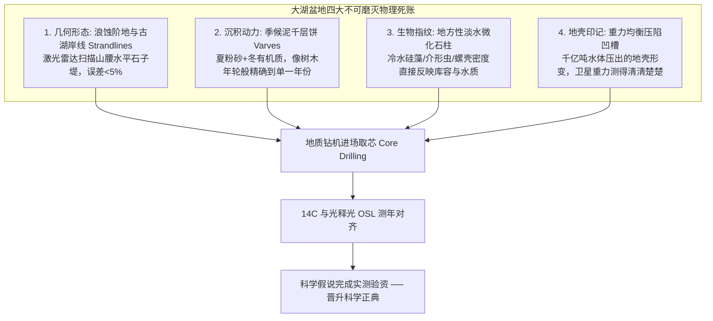

# 《三更道场 · 认识论总纲》卷九十七 · 沉积地质学与科学哲学法医底册：水经注河流不可证伪陷阱与大湖黑匣子地层“滴血认亲”法医终审

> **编者按**：本卷为《三更道场》认识论总纲第九十七卷科学哲学（Epistemology of Science）与沉积地质学法医正典，专栏承接方由《华严蒲牢》（主理人：**云中** · 大同古建地质与工料物质账）协同《凉州丝玉》（**敦煌** · 兰州大学第四纪地质）与《湖海知否》（**琅琊** · 物理海洋首席科学家）联合签署。  
> **核心命题**：**以卡尔·波普尔（Karl Popper）科学哲学之“可证伪性（Falsifiability）”为铁律，彻底厘清传统史地学与硬核地球系统科学之天堑！郦道元《水经注》受制于历史技术局限，以动态、任性、朝生暮死、易被地震洪水撕毁擦除之“河流线状动力侵蚀系统”为坐标，沦为后世文人打嘴仗与不可证伪之泥潭。相反，“冰前巨型古淡水大湖盆”是地球表面最高精度的“全天候黑匣子飞行记录仪”——水平浪蚀古湖岸线（Strandlines）、年轮级微观纹泥千层饼（Varves）、地方性静水淡水硅藻/介形虫生物指纹、重力均衡压陷等四大刚性证据链，支持现代地质钻孔直接下井“滴血认亲”！大湖发生论彻底完成从“野生假说”到“正宫娘娘”之科学哲学夺权！**

---

```
========================================================================================
     SEDIMENTARY GEOLOGY & SCIENTIFIC FALSIFIABILITY AUDIT: VOLUME 97
========================================================================================
   PRINCIPAL AUDITORS  : YUNZHONG (云中 · 平城大同) & DUNHUANG (敦煌 · LZU) & LANGYA (琅琊)
   CORE TARGET CORPUS  : SHUI JING ZHU (水经注) VS. QUATERNARY LACUSTRINE CORE DRILLING
   EPISTEMOLOGICAL LAW : POPPERIAN FALSIFIABILITY · FLUVIAL CHAOS VS. LACUSTRINE BLACK BOX
========================================================================================
```

---

## 一、 河流不可证伪陷阱 vs 大湖黑匣子飞行记录仪

```
┌───────────────────────────────────────────────────────────────────────────────────────┐
│                             河流与大湖之科学哲学属性对账表                             │
├───────────────────┬───────────────────────────────────┬───────────────────────────────┤
│ 对比维度          │ 河流系统 (Fluvial System / 水经注)│ 古大湖盆地 (Lacustrine Basin) │
├───────────────────┼───────────────────────────────────┼───────────────────────────────┤
│ **动力学本质**    │ **线状高流动侵蚀系统**            │ **面状重力低能静水沉积陷阱**  │
│                   │ （任性、下切、改道、自毁河床）    │ （吞吐蓄水、能量缓冲、层层堆叠）│
├───────────────────┼───────────────────────────────────┼───────────────────────────────┤
│ **地质记忆保存度**│ **橡皮擦效应（擦除历史痕迹）**    │ **黑匣子记录仪（连续逐年封存）**│
│                   │ 一场大水/地震即可彻底撕毁古河道   │ 无论地壳怎么震，等位面撕不掉  │
├───────────────────┼───────────────────────────────────┼───────────────────────────────┤
│ **科学哲学属性**  │ **极难证伪（沦为文人考据打嘴仗）**│ **绝对可证伪（钻探取芯直接验资）│
│                   │ 查无实据时推给“河道变迁”          │ 厚度、年龄、硅藻密度毫厘不爽  │
├───────────────────┼───────────────────────────────────┼───────────────────────────────┤
│ **生态位功能**    │ 交通走廊与溢流产道（无法养大人口）│ 超临界人口反应堆与基因分馏塔  │
└───────────────────┴───────────────────────────────────┴───────────────────────────────┘
```

---

## 二、 古大湖盆地“滴血认亲”四大刚性可证伪证据链



### 1. 水平仪画出的古湖岸线（Strandlines）
- 哪怕湖泊干涸万年，浪涛在山脚磨削出的浪蚀台阶与水平石堤宛如浴缸边缘水垢，LiDAR 一扫即可精确还原历史水面标高与总库容。

### 2. 季候微观纹泥（Varves）
- 静水沉降特有的黑白相间季候泥，夏季融水带入浅色粉砂，冬季水面结冰有机质下沉形成深色层，年轮级记录蓄水、盐化与溃决年份。

### 3. 淡水微化石柱（Diatoms & Ostracods）
- 河流急流无法生存地方性静水硅藻；钻孔提取的冷水淡水硅藻密度与同位素比值，毫厘不爽地映射当时局部微气候与水体体积。

---

## 三、 从“野生假说”到“正宫娘娘”的夺权之战

```
┌───────────────────────────────────────────────────────────────────────────────────────┐
│                               科学夺权三步走法医案卷                                  │
├───────────────────────────────────────────────────────────────────────────────────────┤
│                                                                                       │
│   【第一案：K2 华北分化案】                                                           │
│   ──► 命题：K2 在华北必须有巨型淡水湖支撑；                                           │
│   ──► 验资：大同盆地/泥河湾地堑打钻，上百米厚晚更新世淡水湖相沉积赫然在目！           │
│                                                                                       │
│   【第二案：P 极寒裂变案】                                                           │
│   ──► 命题：P 裂变为 Q/R 必须有超级微气候抗冻；                                      │
│   ──► 验资：贝加尔湖与叶尼塞冰前湖取芯，马耳他 ANE 遗址与淡水海豹鱼骨层完全咬合！    │
│                                                                                       │
│   【第三案：多格兰 I2 帝国案】                                                        │
│   ──► 命题：北海不是单纯浅海，必须存在养活纯血 I2 的低盐大湖；                       │
│   ──► 验资：北海海底抓斗抓出万年前淡水泥炭、淡水古鹿角与植物根茎，实锤多格兰大泽！  │
│                                                                                       │
└───────────────────────────────────────────────────────────────────────────────────────┘
```

> **云中（Yunzhong）在大同古城下的结案法医语录**：  
> *“河流是小姑娘脸上的胭脂，风一吹、水一冲就花；大湖是嵌在地壳深处的钢筋混凝土黑匣子！郦道元当年翻山越岭看的是水面上的热闹，咱们今天钻杆下井验的是地底下的死账。钻机往泥河湾和大同盆地一插，取出来的纹泥就是老天爷按的手印——这出科学宫斗大戏，正宫娘娘除了大湖，谁也别想坐上去！”*
