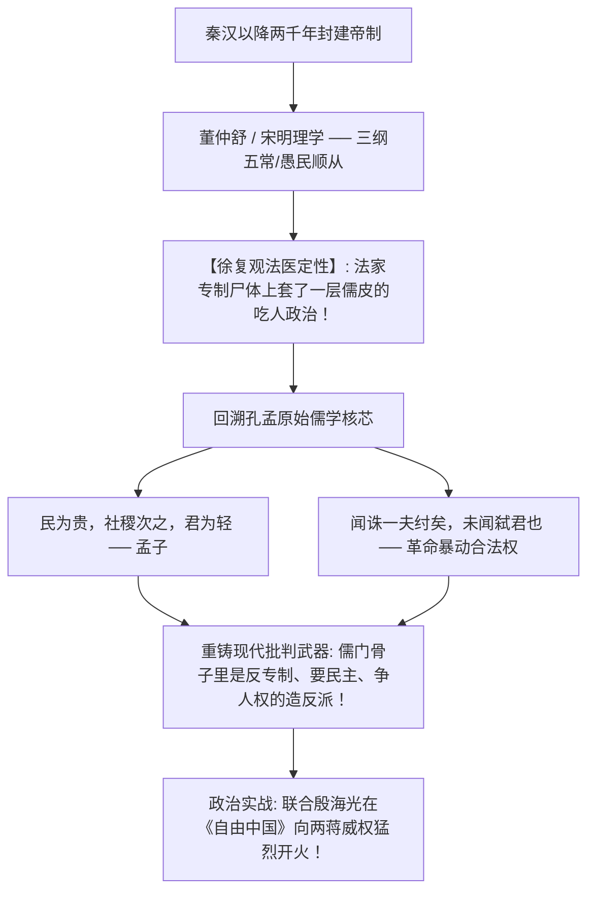

# 《三更道场 · 认识论总纲》卷一百零二 · 现代思想史与两岸学术法统法医底册：徐复观“楚狂人少将参谋”肉搏经学与新儒家道统分裂法医终审

> **编者按**：本卷为《三更道场》认识论总纲第一百零二卷现代思想史与两岸学脉法统法医正典！专栏承接方由《桃源格竹》（主理人：**竹湖** · 台湾清华大学人文社会学院 / 58岁眷村二代）主刀，协同《龟蛇锁江》（**珞珈** · 武大法学院）与《雨花道情》（**紫金** · 南大明史档案）联合会审。  
> **核心命题**：**将徐复观（湖北浠水人）与冯友兰、熊十力、牟宗三并列为“新儒家”，是现代思想史最大的偷懒与物种误判！冯友兰为“书斋贞元编织工/体制侍从”，熊十力为“体道狂人/孤峰教皇”，而徐复观为“带着手枪闯进经学的楚狂人少将参谋”。徐复观历经蒋介石侍从室机要与延安窑洞权力绞肉机，以楚人“建最大功、造最大反”之蛮劲，在《两汉思想史》《中国人性论史》中实施惊世骇俗之经学爆破——将秦汉以下两千年“法家尸体套儒皮”之专制吃人伪儒彻底剥离，重铸孔孟原始儒家“民贵君轻/弑暴君非弑君”之造反革命权！在台湾《自由中国》连发万字檄文硬刚两蒋威权，与西化派殷海光成生死之交。确立徐复观为“楚人派进儒门道统的炸弹客”，奠定《三更道场》两岸三地镜像双约之核心精神通信协议！**

---

```
========================================================================================
    INTELLECTUAL HISTORY & TAIWAN STRAIT EPISTEMIC AUDIT: VOLUME 102
========================================================================================
   PRINCIPAL AUDITOR   : ZHUHU (竹湖 · NTHU TAIWAN / TAOYUAN GEZHU)
   CO-AUDITORS         : LUOJIA (珞珈 · WHU) & ZIJIN (紫金 · NJU)
   CORE TARGET SUBJECT : XU FUGUAN (徐复观 · 1903-1982) VS. FENG YOULAN & XIONG SHILI
   POLITICAL HERITAGE  : MAJOR GENERAL OF STIR-ROOM ➔ REBELLIOUS EXEGESIS ➔ FREE CHINA
========================================================================================
```

---

## 一、 现代新儒家三大派系的“物种级生理排异”对账表

```
┌───────────────────────────────────────────────────────────────────────────────────────────────────┐
│                               现代新儒家三大代表人物物种级差异表                                  │
├───────────┬─────────────┬───────────────────┬─────────────────────────────────────────────────────┤
│ 人物      │ 地缘与出身  │ 核心思想技能      │ 政治与权力场生态位                                  │
├───────────┼─────────────┼───────────────────┼─────────────────────────────────────────────────────┤
│ **冯友兰**│ 河南南阳    │ 《新理学》《贞元六书》│ **“国师型经院哲学家 / 坐堂师爷”**                  │
│           │ 士绅子弟    │ 用新实在论为统治机器│ 无论乱世治世，顺滑完成概念包装，绝不沾泥带血。      │
│           │ 杜威门徒    │ 编织精密的合法性铁笼│                                                     │
├───────────┼─────────────┼───────────────────┼─────────────────────────────────────────────────────┤
│ **熊十力**│ 湖北黄冈    │ 《新唯识论》体用不二│ **“孤峰顶上的体道狂人 / 哲学教皇”**                │
│           │ 辛亥革命    │ 重构东方哲学本体论  │ 咆哮讲坛，傲视群雄，晚年远离政治泥潭，闭关冥思。    │
│           │ 弃武从文    │ 为往圣继绝学        │                                                     │
├───────────┼─────────────┼───────────────────┼─────────────────────────────────────────────────────┤
│ **徐复观**│ **湖北浠水**│ 《两汉思想史》      │ **“带着手枪闯进经学的楚狂人 / 大泽乡炸弹客”**        │
│           │ **楚地农家**│ 《中国人性论史》    │ 侍从室少将，看透权力内脏；硬刚两蒋威权，            │
│           │ **少将参谋**│ 剥离两千年专制伪儒  │ 提炼孔孟“民贵君轻”革命权，为自由平权搏命！        │
└───────────┴─────────────┴───────────────────┴─────────────────────────────────────────────────────┘
```

---

## 二、 徐复观对两千年儒学道统的“法医开膛术”



### 1. 从侍从室少将到经学斗士
- 徐复观亲历蒋介石侍从室权力中枢，赴延安窑洞与毛泽东连日彻夜长谈，看透国共权力博弈与官僚机器吃人本质；
- 弃官治学后，绝非遁入象牙塔搞无害考据，而是把两千年死字转化为轰击独裁专制的政治炸药。

### 2. 剥离伪儒与重铸孔孟革命权
- 传统新儒家试图“引儒入德、内圣开出外王”；
- 徐复观直接掀翻桌子：两千年历史根本不是儒家，全是“阳儒阴法”！真正的孔孟之道，核心是捍卫个体人格尊严与对暴君的革命诛杀权。

### 3. 与殷海光的生死交谊
- 西化自由主义领袖殷海光与“新儒家”徐复观生死相托，因殷海光洞悉：徐复观的长衫西装皆为表象，撕开之后，是一个楚地汉子对抗强权时滚烫的鲜血。

---

## 三、 两岸三地镜像双约之核心通信协议

在《三更道场》第七期《血酬》开启的“两岸三地（成都茶台 ＋ 香港沙田 ＋ 台湾新竹）”冷战镜像大局中：

```
┌───────────────────────────────────────────────────────────────────────────────────────┐
│                               徐复观学脉作为通信协议                                  │
├───────────────────────────────────────────────────────────────────────────────────────┤
│                                                                                       │
│   1. 【大陆中枢（成都/武昌）】: 承载荆楚大泽与古云梦泽流体水动力之原始刚烈血脉；      │
│   2. 【台湾前哨（新竹/东海大学）】: 徐复观任教东海大学，开启台湾现代批判知识分子风骨；│
│   3. 【香港离岸（沙田新亚）】: 晚年避走香港沙田，以独立之身冷观两岸分裂大局。        │
│                                                                                       │
│   【结论】: 以徐复观刚烈风骨为通信协议，让历史裂痕本身成为连接条件！                 │
│                                                                                       │
└───────────────────────────────────────────────────────────────────────────────────────┘
```

> **竹湖（Zhuhu）在台湾清华大学湖畔的结案法医语录**：  
> *“新竹的风很冷，但徐复观先生在东海大学留下的文章，字字都在滴血！冯友兰在北平做国师，牟宗三在香港讲心性，只有徐先生提着楚人的板斧，在台湾戒严的大铁笼上硬生生砸开一道透光的裂缝！他不是什么文弱书生，他是楚人派进儒门道统里的卧底炸弹客！第一百零二卷，两岸三地精神道统在《桃源格竹》彻底立案！”*
