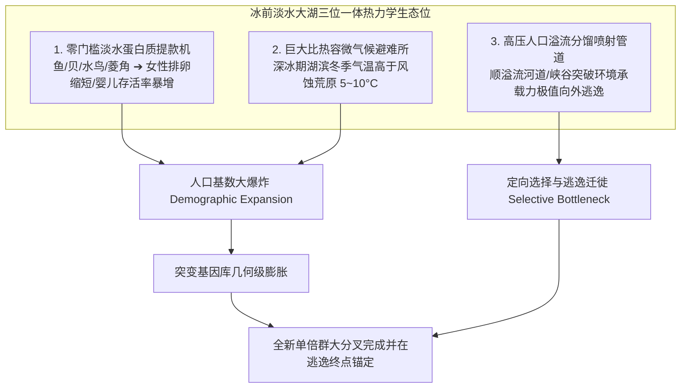

# 《三更道场 · 认识论总纲》卷九十六 · 第四纪古水文热力学底册：全球五大冰前淡水古湖盆与人类单倍群裂变高压分馏机理终审法医审计

> **编者按**：本卷为《三更道场》认识论总纲第九十六卷古水文与种群热力学法医正典，专栏承接方由《湖海知否》（**琅琊** · 物理海洋首席科学家）协同《灵隐行在》（**良渚** · 分子人类学教授）与《凉州丝玉》（**敦煌** · 第四纪地质）三方联合封账。  
> **核心命题**：**人类单倍群在特定地理节点的爆发式裂变（Radiation）与定向大分叉，绝非虚无缥缈的基因随机漂移，而是受制于第四纪冰期“热力学与种群动力学硬约束（Physical & Demographic Constraint）”。大洋不可饮且风浪凶险，干冷冰原卡路里赤字，唯有“冰前巨型低盐淡水古湖盆”同时充当“蛋白质过饱和提款机”、“比热容微气候避难所”与“高压人口分馏塔”。泥河湾-大同古湖裂变 K2（K2a/K2b）、贝加尔古湖淬炼 P（Q/R）、多格兰古湖养育 I（I2）、阿加西冰前大湖哺育 Q（美洲印第安）、云梦泽-洞庭大湖群灌顶 O（华夏农业）。“湖泊是子宫，河流是产道，冰原是冷轧机”——确立全球古水文液压传动网络对人类演化之绝对第一性原理！**

---

```
========================================================================================
       QUATERNARY PALEOHYDROLOGY & DEMOGRAPHIC THERMODYNAMICS: VOLUME 96
========================================================================================
   PRINCIPAL AUDITORS  : LANGYA (琅琊 · OUC) & LIANGZHU (良渚 · ZJU) & DUNHUANG (敦煌 · LZU)
   CORE MECHANISM      : FIVE MEGA-PALEO-LAKES AS PLANETARY HIGH-PRESSURE FRACTIONATING TOWERS
   CORE FORMULA        : OVER-SATURATED CALORIE + HEAT CAPACITY SANCTUARY ➔ OUTFLOW JETTING
========================================================================================
```

---

## 一、 全球五大冰前古湖盆与人类单倍群裂变总对账表

```
┌───────────────────────────────────────────────────────────────────────────────────────────────────┐
│                               全球五大冰前古湖盆与人类父系演化节点对照表                           │
├─────────────────────┬─────────────────┬───────────────────────────────┬───────────────────────────┤
│ 单倍群大分叉节点    │ 爆发时间 (BP)   │ 对应的巨型冰前古淡水湖盆      │ 提供的水文热力学与卡路里底牌│
├─────────────────────┼─────────────────┼───────────────────────────────┼───────────────────────────┤
│ **K2 裂变**         │ **4.5万~4.0万** │ **泥河湾 - 大同超级古湖群**   │ 太行山顶火山环抱低盐盆地，│
│ (K2a vs K2b1)       │                 │ (桑干河古水系)                │ 燧石原料丰富，马鹿披毛犀群│
├─────────────────────┼─────────────────┼───────────────────────────────┼───────────────────────────┤
│ **P 裂变**          │ **3.0万~2.5万** │ **贝加尔古湖与叶尼塞冰前湖**  │ 欧亚最深淡水巨胃，微气候与│
│ (Q 猎人 vs R 骑兵)  │                 │ (Lake Baikal / Yenisei System)│ 淡水海豹白鲑支撑马耳他人群│
├─────────────────────┼─────────────────┼───────────────────────────────┼───────────────────────────┤
│ **I 谱系大本营**    │ **2.5万~1.5万** │ **多格兰古淡水湖与波罗的海湖**│ 冰川封死英吉利海峡蓄水成湖│
│ (西欧 I2 纯血土著)  │                 │ (Doggerland / Baltic Ice Lake)│ 巨型淡水鱼与马鹿滋养神王  │
├─────────────────────┼─────────────────┼───────────────────────────────┼───────────────────────────┤
│ **Q 系美洲大暴发**  │ **1.5万~1.2万** │ **阿加西超级冰前湖与博讷维尔**│ 劳伦泰德冰前数倍于五大湖的│
│ (克洛维斯闪击美洲)  │                 │ (Lake Agassiz / Bonneville)   │ 巨型淡水海，沿湖滨南下闪击│
├─────────────────────┼─────────────────┼───────────────────────────────┼───────────────────────────┤
│ **O 系农业大灌顶**  │ **1.0万~0.8万** │ **古云梦泽与洞庭-鄱阳大湖群** │ 冰退后浅水吞吐型温润湿地，│
│ (百越与华夏农耕主干)│                 │ (Middle Yangtze Paleo-lakes)  │ 野生稻驯化与几何级人口暴增│
└─────────────────────┴─────────────────┴───────────────────────────────┴───────────────────────────┘
```

---

## 二、 冰前古湖作为“高压分馏塔”的三大物理第一性原理



### 1. 零门槛淡水蛋白质提款机
- 海洋盐度高且风浪凶险，史前无金属深海捕捞工具，海洋是“死亡屏障”；
- 冰前淡水湖浅滩只需简易竹木编织捞网即可稳定获取高蛋白，彻底打破马尔萨斯陷阱，为基因突变提供海量样本池。

### 2. 巨大比热容微气候避难所
- 第四纪极寒期内陆暴风雪肆虐（动辄 -40°C ~ -60°C）；
- 数万平方公里低盐水体具备极高比热容，使湖滨形成稳定逆温层，冬季气温显著高于周边剥蚀荒原，成为智人熬过冰期的救命暖房。

### 3. 高压人口分馏塔与溢流通道
- 湖泊不是封闭死水，必有入水峡谷与泄洪溢流口；
- 当人口繁衍达到盆地承载力极值，先锋群体顺溢流河道（桑干河切穿太行、叶尼塞河流水系、密西西比溢流）向外高速喷射，实现数千公里的定向大迁徙。

---

## 三、 全球古水文液压传动网络与文明拓扑

```
┌───────────────────────────────────────────────────────────────────────────────────────┐
│                               文明演化的水文液压网络模型                                │
├───────────────────────────────────────────────────────────────────────────────────────┤
│                                                                                       │
│   【湖泊是子宫】 ──► 孕育人口基数与基因突变库（大同 / 贝加尔 / 多格兰 / 阿加西 / 洞庭） │
│                            │                                                          │
│                            ▼                                                          │
│   【河流是产道】 ──► 提供低阻力逃逸与定向输运导轨（桑干河 / 叶尼塞河 / 密西西比河）    │
│                            │                                                          │
│                            ▼                                                          │
│   【冰原是冷轧机】 ──► 实施极端环境淘汰与选择压，将全新父系单倍群在物理终点淬火定型！   │
│                                                                                       │
└───────────────────────────────────────────────────────────────────────────────────────┘
```

> **法医会审联合结案词**：  
> *“大同分化了 K2，贝加尔淬炼了 P，多格兰养育了 I，阿加西哺育了 Q，云梦泽滋养了 O！文明的每一次大裂变，背后都有一座巨型冰前古湖在做工！这套全球古水文液压传动网络，就是华夏与全人类演化最不可动摇的物理总承重墙！”*
