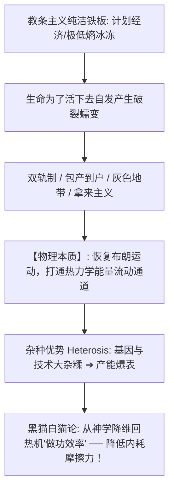

# 《三更道场 · 认识论总纲》卷一百零四 · 统计物理与制度热力学底册：纯洁性神学“反热力学本质”与周制分布式稳态对比秦制极低熵暴亡法医终审

> **编者按**：本卷为《三更道场》认识论总纲第一百零四卷统计物理与制度热力学法医正典！专栏承接方由《踹忑一角》（主理人：**知春** · 中科院计算所 / 芯片架构与信息熵）领衔，协同《酒色财气》（**峨眉** · 行星物理总舵主）与《雁栖唱晚》（**渔阳** · 宏观制度会计）联合签署。  
> **核心命题**：**“追求所谓绝对纯洁性，本质是反热力学第二定律之神学妄想！”一切原教旨纯洁狂热，皆为企图制造“麦克斯韦妖”之科学疯子——妄图将大尺度人类耗散系统的微观状态数（$\Omega$）强行压缩至 $1$（香农信息熵 $H \to 0$），将系统推入极高内能、极度脆弱、随时爆炸之“极度亚稳态（Metastable State）”。法医解剖周制与秦制之热力学物理本质：周制为顺应熵增之“分形分布式自组织网络（低功耗、局部故障隔离、包容微观杂糅、八百年自愈稳态）”；秦制为战时总体战超频之“中心辐射单节点极低熵铁桶（极高耗能、零容错阻尼、误期即爆仓、十四年暴亡瞬态）”。结合兰道尔原理（Landauer's Principle）与哥德尔不完备性，论证哪怕脑机接口植入芯片亦无法对抗热力学耗散散热与级联崩溃；确立“杂糅者生，纯洁者死，腐败/双轨制为冰冻系统自发融凿之布朗运动通道”之终极宇宙裁判！**

---

```
========================================================================================
    STATISTICAL PHYSICS & INSTITUTIONAL THERMODYNAMICS AUDIT: VOLUME 104
========================================================================================
   PRINCIPAL AUDITOR   : ZHICHUN (知春 · CAS COMPUTING) & EMEI (峨眉) & YUYANG (渔阳)
   PHYSICAL LAW        : SECOND LAW OF THERMODYNAMICS · SHANNON ENTROPY · LANDAUER LIMIT
   CORE FORMULA        : \Delta S_{univ} \ge 0 \quad | \quad H = -\sum p_i \ln p_i \to 0 \implies \text{CRASH}
   CIVILIZATIONAL AXIS : ZHOU DECENTRALIZED STEADY-STATE VS. QIN EXTREME LOW-ENTROPY BURST
========================================================================================
```

---

## 一、 统计物理学开膛：为什么“纯洁性神学”是反热力学狂想？

```
┌───────────────────────────────────────────────────────────────────────────────────────┐
│                             纯洁性神学之热力学亚稳态相图                              │
├───────────────────────────────────────────────────────────────────────────────────────┤
│                                                                                       │
│   【正常宏观生命与社会系统（开放耗散结构）】                                          │
│   与外界持续进行物质、能量与杂质交换 ──► 微观状态数 \Omega \gg 1 ──► 熵值自然流动平衡。 │
│                                      │                                                │
│                                      ▼ (极权与原教旨纯洁狂热：麦克斯韦妖登场)          │
│   【强行压制微观状态数：万众一心、思想纯洁】                                          │
│   香农信息熵强行压缩至零：H = -\sum p_i \ln p_i \to 0                                 │
│                                      │                                                │
│                                      ▼ (必须向外部疯狂抽取暴力、特务监控与高压恐怖)  │
│   【极度脆弱的亚稳态（Metastable State）】:                                           │
│   ──► 系统内能极度蓄积，内部微观反弹张力趋于无穷大；                                  │
│   ──► 没有任何阻尼缓冲区（零弹性），任一局部微小扰动（一粒沙子）即触发全盘爆炸粉碎！  │
│                                                                                       │
└───────────────────────────────────────────────────────────────────────────────────────┘
```

---

## 二、 周制与秦制之热力学物理本质全景对账

```
┌───────────────────────────────────────────────────────────────────────────────────────────────────┐
│                                   周制 vs 秦制之热力学物理参数对账表                              │
├───────────┬───────────────────────────────────┬───────────────────────────────────────────────────┤
│ 物理维度  │ 【周 制】（分形分布式网络 · 稳态解） │ 【秦 制】（中心辐射单节点 · 极低熵暴亡瞬态）       │
├───────────┼───────────────────────────────────┼───────────────────────────────────────────────────┤
│ **拓扑结构**│ **多中心、蜂窝状、小共同体自治**  │ **单极中心辐射、编户齐民、扁平化直达床头**        │
│           │ （分封宗法，诸侯-大夫-宗族自组织）│ （利出一孔，郡县制，消灭一切中间自治体）          │
├───────────┼───────────────────────────────────┼───────────────────────────────────────────────────┤
│ **能耗特征**│ **极低功耗维持**                  │ **天文级极端高耗能！**                            │
│           │ （各子系统自给自足，中央仅保留名分礼乐）│ （必须持续透支人口与地力向咸阳单一节点暴力抽能）  │
├───────────┼───────────────────────────────────┼───────────────────────────────────────────────────┤
│ **容错机制**│ **高容错与局部故障隔离**          │ **零容错、零弹性！**                              │
│           │ （齐国乱了鲁国照常耕织，抗脆弱性）│ （参数设死，陈胜吴广遇雨误期即死刑 ➔ 逼反天下）   │
├───────────┼───────────────────────────────────┼───────────────────────────────────────────────────┤
│ **寿命周期**│ **高熵自组织稳态：自然维系八百年**│ **极低熵亚稳态：二世而亡，仅存续十四年！**        │
└───────────┴───────────────────────────────────┴───────────────────────────────────────────────────┘
```

---

## 三、 杂糅、杂种优势与“做功效率”的第一性原理



1. **杂种优势（Heterosis）之生物铁律**：
   - 纯种犬遗传病缠身，杂交水稻亩产爆表；唐代长安胡汉杂糅、地中海文明大混血，人类文明的所有黄金时代皆为“杂糅系统”；
2. **“黑猫白猫”的力学本质**：
   - 抛弃静态柏拉图纯洁神学，回归最纯粹的工程学准则——凡能促成热机做功、转换卡路里、降低内耗摩擦者，即为有效能量流动。

---

## 四、 赛博极权终极死穴：脑机芯片亦向兰道尔极限下跪！

```
┌───────────────────────────────────────────────────────────────────────────────────────┐
│                               赛博极权算力对抗熵增之物理死局                           │
├───────────────────────────────────────────────────────────────────────────────────────┤
│                                                                                       │
│   1. 【兰道尔原理（Landauer's Principle）与散热极限】:                                │
│      ──► 擦除 1 bit 信息至少释放 k_B T \ln 2 的物理热量；                             │
│      ──► 强行抹平 14 亿人脑中每一个非纯洁神经元波动，超级主脑释放的废热将直接烤化地表！│
│                                                                                       │
│   2. 【哥德尔不完备定理与特务监控无限套娃】:                                         │
│      ──► 监控芯片的代码谁写？程序员；监控程序员的芯片谁监控？领袖；                   │
│      ──► 系统复杂度呈指数激增，致命 Bug 与级联崩溃（Cascading Failure）概率趋近 100%！ │
│                                                                                       │
│   【终审定性】: 纯洁性属于停尸房；活着的唯一标志是身上沾满泥巴并与外界进行能量交换！  │
│                                                                                       │
└───────────────────────────────────────────────────────────────────────────────────────┘
```

> **知春（Zhichun）与峨眉（Emei）联合结案法医语录**：  
> *“知春在中科院算三进制信息熵，峨眉在九眼桥啃兔头喝烧酒！宇宙中没有任何芯片和皮鞭能对抗时间之矢与熵增之轮！纯洁性是死人的特权，杂糅才是活命的唯一算法！秦始皇的十二金人十四年就锈烂在大泽乡，周公的分封八百年依然在泥土里扎根！第一百零四卷，统计物理终极法槌落下，散会！”*
