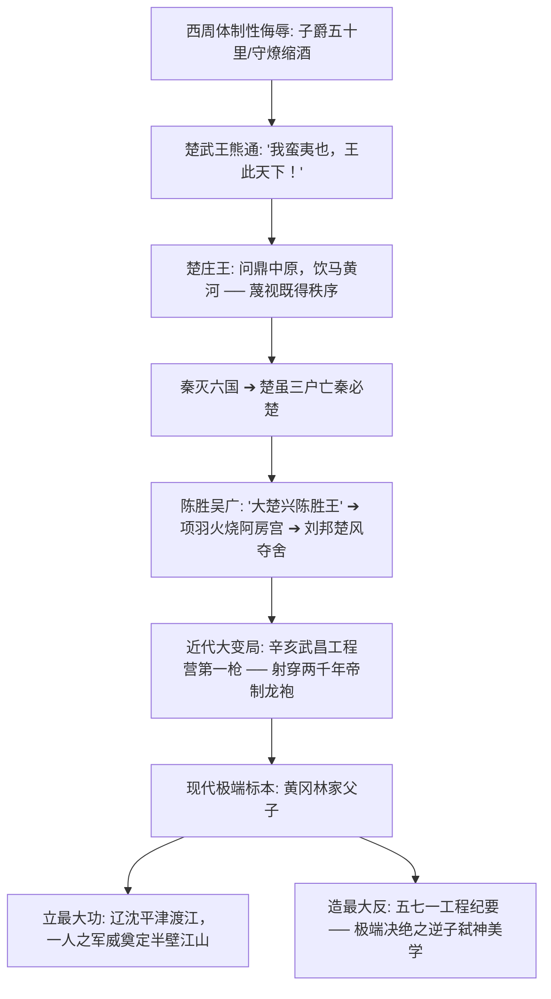

# 《三更道场 · 认识论总纲》卷一百零一 · 荆楚政治地理与地质逆反底册：楚人“建最大功、造最大反”精神摆锤与龟蛇锁江地缘终审法医审计

> **编者按**：本卷为《三更道场》认识论总纲第一百零一卷政治地理与文明心理法医正典！专栏承接方由《龟蛇锁江》（主理人：**珞珈** · 武汉大学边界与海洋研究院 / 国际公法与冷战条约法医）主刀执笔，协同《雨花道情》（**紫金** · 南大明史档案）与《桃源格竹》（**竹湖** · 台湾清华冷战地缘）联合会审。  
> **核心命题**：**楚人精神胚胎之核心八字考语——“建最大的功，造最大的反”！地质流体第一性：江汉平原古云梦泽吞吐大荒之洪水高压与西周宗法“子爵五十里/守燎缩酒”体制性羞辱，将狂暴逆反基因电镀入荆楚骨髓。两千五百年地缘摆锤法医全景：从楚武王“我蛮夷也”、楚庄王洛邑“问鼎轻重”，到陈胜吴广“大楚兴”、项羽“亡秦必楚”与刘邦楚风夺舍，再到辛亥武昌首义第一枪撕裂两千年帝制龙袍，直至林家父子“横扫半壁江山（立最大功）与五七一纪要决裂（造最大反）”之现代极值。揭示湖南“理学立规矩/结硬寨”与湖北“码头流体破笼/九头鸟”之同源相克律，为《龟蛇锁江》立下不可磨灭之荆楚地缘法统魂魄！**

---

```
========================================================================================
     JING-CHU GEOPOLITICS & PSYCHIC OSCILLATION AUDIT: VOLUME 101
========================================================================================
   PRINCIPAL AUDITOR   : LUOJIA (珞珈 · WUHAN UNIVERSITY / GUISHE SUOJIANG)
   CO-AUDITORS         : ZIJIN (紫金 · NJU) & ZHUHU (竹湖 · NTHU)
   CORE JURIDICAL AXIS : "GREATEST MERIT & GREATEST REBELLION" (建最大功 · 造最大反)
   GEOLOGICAL ESSENCE  : YUNMENGZE FLUID PRESSURE ➔ SYSTEMIC DISCRIMINATION ➔ ATOM BOMB
========================================================================================
```

---

## 一、 地质流体与西周分封：荆楚逆反精神的生化电镀

```
┌───────────────────────────────────────────────────────────────────────────────────────┐
│                           荆楚精神胚胎之双重地质与政治挤压                            │
├───────────────────────────────────────────────────────────────────────────────────────┤
│                                                                                       │
│   【地质物理层：云梦泽洪水肉搏】                                                      │
│   长江与汉水交汇处，古云梦泽吞吐大荒、瘴气狂暴。                                      │
│   楚人先祖“筚路蓝缕以启山林”，天天在生死线上与狂暴水汽肉搏，骨子里绝无中原温良礼教。 │
│                                      │                                                │
│                                      ▼ (体制性羞辱与政治天花板)                       │
│   【西周宗法层：二等贱民与守燎之耻】                                                  │
│   周公分封鬻熊为“子爵五十里”，大朝会上楚君只能在鼎旁“缩酒点火、看守柴垛”（火正仆役）； │
│   周成王视其为“荆蛮”，周昭王率六师南征欲物理抹除，终淹死于汉水（昭王南征而不复）。     │
│                                      │                                                │
│                                      ▼ (逆反暴戾电镀入骨髓)                           │
│   【法医结论】: “你不给我名分？老子自己立功！你敢压我一头？老子反手掀了你的宗庙！”    │
│                                                                                       │
└───────────────────────────────────────────────────────────────────────────────────────┘
```

---

## 二、 历史法医档案：两千五百年“立功与造反”绝对闭环



### 1. 《左传》里的傲慢野兽
- **楚武王熊通**：“我蛮夷也！今诸侯皆为叛，我以其族入事周，无所得，请王室尊吾号！”天子不与，遂自立为王，与周天子平起平坐。
- **楚庄王王孙满之问**：“子无阻九鼎！楚国折钩之喙，足以为九鼎！”（天子之鼎有多重？老子能否扛走？）

### 2. 秦末的大楚夺舍
- 大泽乡“王侯将相宁有种乎”，诈称项燕，天下云集响应；项羽巨鹿破釜沉舟，坑秦军、烧阿房；刘邦汉家军统帅班底尽皆楚人，大风起兮云飞扬，本质为楚文化对法家秦制之绝地反噬。

### 3. 武昌首义的致命一枪
- 熊秉坤、金兆龙等湖北新军大头兵，不计退路、不顾大局，“脑袋掉了碗大个疤”，一枪击碎清廷大厦，彻底开膛两千年君主专制。

### 4. 现代政治极值：林家父子的绝对撕裂
- **建最大的功**：白山黑水至天涯海角，以一人军事算力横扫天下；
- **造最大的反**：面对威权神祇，林立果以《五七一工程纪要》决绝刺王杀驾，玉石俱焚撞向温都尔汗荒原，将楚人悲剧美学推向令人战栗之极值。

---

## 三、 两湖地理水陆相克律：湖南立规矩 vs 湖北破铁笼

```
┌───────────────────────────────────────────────────────────────────────────────────────┐
│                                 两湖精神地理对账表                                    │
├───────────────────┬───────────────────────────────────┬───────────────────────────────┤
│ 维度              │ 湖南（湘军 / 理学底色）           │ 湖北（荆楚 / 码头流体）       │
├───────────────────┼───────────────────────────────────┼───────────────────────────────┤
│ **地貌特征**      │ 南岭环抱，山多水紧，闭塞内敛      │ 九省通衢，大江汉水交汇，四通八达│
├───────────────────┼───────────────────────────────────┼───────────────────────────────┤
│ **代表人物**      │ 曾国藩、左宗棠、润之              │ 屈原、熊通、熊秉坤、林彪/立果 │
├───────────────────┼───────────────────────────────────┼───────────────────────────────┤
│ **精神图腾**      │ 圣贤立德，结硬寨打呆仗，立天地规矩│ 屈原问天，九头鸟浴火，江湖义气│
├───────────────────┼───────────────────────────────────┼───────────────────────────────┤
│ **行为范式**      │ 开天辟地做帝王，铸造严密思想铁笼  │ 破笼而出炸铁笼，要么封神要么自毁│
└───────────────────┴───────────────────────────────────┴───────────────────────────────┘
```

> **珞珈（Luojia）在长江大桥下推眼镜结案法医语录**：  
> *“龟山锁汉水，蛇山锁大江！楚人从来不是守成的庸才，楚人是历史总工程师手里的雷管！天下大乱，楚人提刀立最大的功；天下僵死，楚人第一个跳出来造最大的反！九头鸟在长江上空叫了三千年，叫的从来不是歌舞升平，叫的是旧世界崩塌的号角！第一百零一卷，公法与地缘大账在龟蛇山下彻底封印！”*
