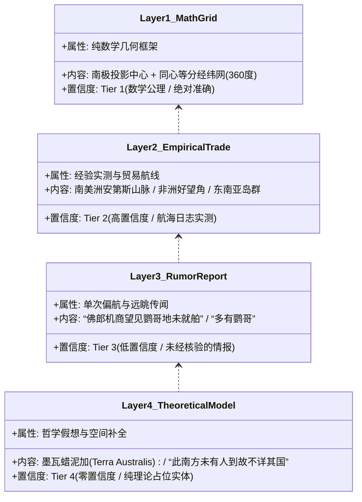
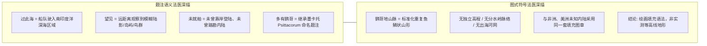
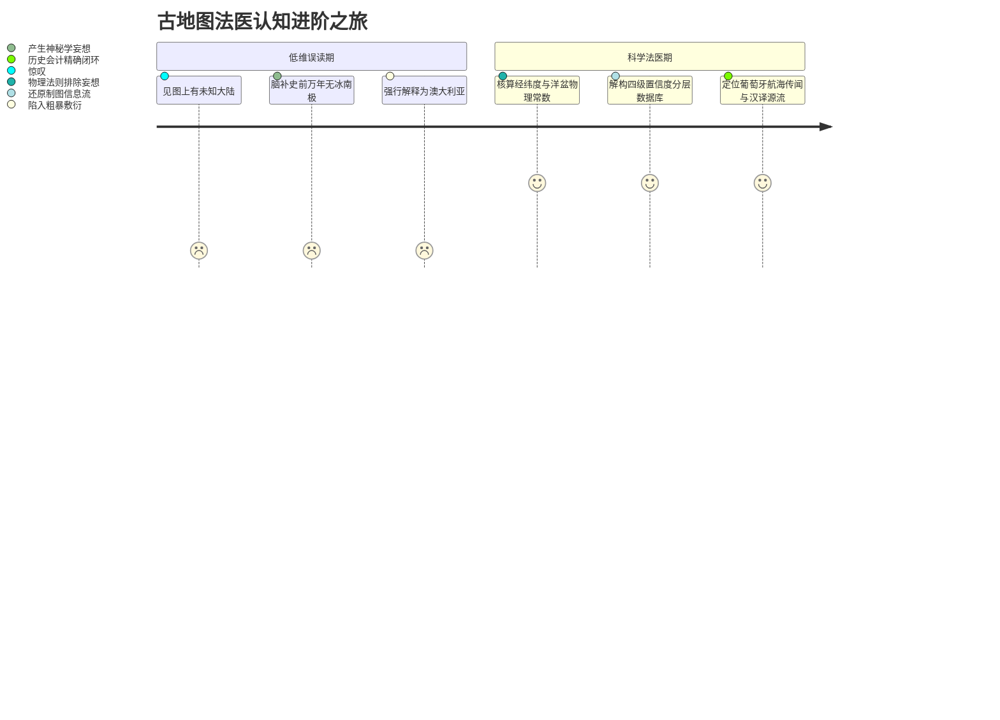

# 三更道场·认识论总纲·文献学与历史会计审计
## 卷四十六：洋盆尺度板块力学、LGM水深边界与《坤舆万国全图》分层数据库法医审计（v1.0）

---

### 摘要与法医审计宪章

本卷审计旨在对利玛窦《坤舆万国全图》（1602）《赤道南半地球之图》中“非洲—鹦哥地海域距离压缩”、“末次盛冰期（LGM）是否导致大洋盆地闭合”及“古代地图作为多源分层数据库的会计属性”进行严格的地球物理学、板块构造动力学与历史制图法医清算。

针对“LGM 时期海平面下降使非洲、南美与南极大陆物理贴近，甚至形成内湖/狭窄海峡”的直觉误判，本审计通过地质力学与水深测量数据，坚决推翻跨越数量级的力学透支，正式确立**“洋盆尺度物理边界（Ocean Basin Physical Bounds）”**与**“古地图四级置信度分层数据库模型（4-Tier Stratified Map Database Model）”**：

> 1. **垂直海退（0.12km）vs 水平洋盆（4000km）的物理数量级断层**：
>    - LGM 全球海平面下降约 **120–130 米（0.12–0.13 km）**，仅能使浅海大陆架（如巽他陆架、萨胡尔陆架、白令陆桥）出露；
>    - 4000 米水深的南冰洋、大西洋与印度洋洋盆在此期间从未干涸；
>    - 板块年均移动仅数厘米（每年 1–10 cm），1.29 万年板块最大位移仅约 **1.3 公里**。若要在 1.29 万年内拉开 4000 公里洋盆，地壳必须以年均 **310 米** 的灾难性超音速撕裂并释放蒸发全球海洋的岩浆热量，该物理图景在地质记录中完全不存在。
> 2. **原始图面注记的自认证（Self-Auditing Notes）**：
>    - 中央大陆题注**“此南方未有人到，故不详其国”**，系制图者自留的免责审计意见（宣告内部未证实）；
>    - **“佛郎机商曾驾船过此海，望见鹦哥地，未就舶”**，系指进入该海域航行时远眺陆影，绝非站在好望角肉眼跨越数千公里望见对岸；
> 3. **地图作为“未加权分层数据库”的会计定性**：
>    - 古地图是将**【实测贸易数据】、【理论几何模型】、【单次航海传闻】与【继承古地名】**压进同一图层的混合数据库。后世研究因混淆图层置信度，才人为制造出“史前超科技神迹”。

---

### 第一章 地球物理学与板块动力学硬账清算

必须将 LGM 浅海大陆架出露与深海大洋盆地在物理尺度上彻底解耦：

```mermaid
graph TD
    subgraph LGM_Capability[LGM 海退 120m 物理有效区 (垂直 Δh = 0.12 km)]
        C1[巽他陆架 Sunda Shelf: 亚洲大陆与爪哇/苏门答腊/婆罗洲相连]
        C2[萨胡尔陆架 Sahul Shelf: 澳大利亚与新几内亚相连]
        C3[白令陆桥 Beringia: 亚欧与美洲连通]
        C4[英吉利海峡与渤海平原出露]
    end

    subgraph Basin_Impossibility[深海洋盆 4000m 物理禁区 (水深 h = 4.0 km)]
        B1[南冰洋/南大西洋深海盆地: 平均水深 3500-5000 米]
        B2[非洲与南极大陆平均间距: 约 4000 公里]
        B3[南美与南极德雷克海峡: 宽约 900 公里，深超 3000 米]
        B4[结论: LGM 120米海退对深海洋盆宽度影响 < 0.1%]
    end

    subgraph Plate_Tectonics[板块移动物理极限量算]
        PT1[板块正常漂移速率: 1 - 10 cm/年]
        PT2[12.9 ka 累积板块位移: 最大 0.0001 km × 12900 = 1.3 km]
        PT3[拉开 4000km 所需速率: 310 米/年 (超速 3000 倍)]
        PT4[物理后果: 全球地壳撕裂熔融，生命彻底灭绝 (地层全无记录)]
    end

    LGM_Capability --- Basin_Impossibility
    Basin_Impossibility --- Plate_Tectonics
```

#### 1.1 地球物理核算台账

| 物理量 / 地理单元 | 实际物理参数（Ground Truth） | 流行误读断言 | 法医判定与误差倍数 |
| :--- | :--- | :--- | :--- |
| **LGM 垂直海退量** | $\Delta z \approx 120 \sim 130 \text{ m}$ | 认为海退能使南冰洋缩减为海峡 | **数量级断层**：深海盆地深达 4000m，120m 影响仅占 3%。 |
| **1.29万年板块位移** | $D_{\text{plate}} \le 1.3 \text{ km}$ | 认为南美、非洲与南极当时物理接壤 | **速率超标 3000 倍**：年移 310m 的超级撕裂物理上不存在。 |
| **巽他与萨胡尔陆架** | 水深 20–100m，LGM 全面露出 | 属于真实成立的冰期地理资产 | **确认入账**：符合第四纪海洋地质学。 |

---

### 第二章 《坤舆万国全图》四级置信度分层数据库法医解剖

《赤道南半地球之图》不是单一片段的“实测抓拍”，而是由四层不同来源、不同置信度数据压装而成的复合信息包：



#### 2.1 四层数据法医分析表

| 图层级别 | 代表性图面元素与注记 | 数据发生机制 | 历史会计处置意见 |
| :--- | :--- | :--- | :--- |
| **第一层：数学网格 (Tier 1)** | 同心纬线（每圈 10°）、放射状经线 | 托勒密球面几何在极射极方位投影下的严格数学渲染。 | **按算法入账**：确立晚明与文艺复兴的制图数学能力。 |
| **第二层：实测地理 (Tier 2)** | 南亚墨利加、利未亚、各港口名称与密布河网 | 哥伦布、达伽马、麦哲伦等船队经天测纬度与航海日志确立的陆块。 | **按实物资产入账**：历史大航海硬核成果。 |
| **第三层：传闻情报 (Tier 3)** | “佛郎机商曾驾船过此海，望见鹦哥地，未就舶” | 葡萄牙船队在好望角外海遭遇狂风偏航，远眺云影/陆影或遭遇海鸟群的未经验单次报告。 | **按或有资产/待查线索入账**：严禁作为生态或大陆存在的直接证据。 |
| **第四层：假想模型 (Tier 4)** | 环南极墨瓦蜡泥加大块、火地岛向南陆桥、“此南方未有人到” | 希腊大地对称平衡理论 + 麦哲伦海峡南岸未知延伸的脑补。 | **按理论模型入账**：制图者已明示“不详”，严禁透支为古测绘遗迹。 |

---

### 第三章 文本与图式的法医深描：“望见未就舶”与“山形符号”



#### 3.1 文本与图式的双重法医判定
1. **语义解构**：
   - 题注“过此海，望见鹦哥地，未就舶”清楚表明：观察者是在**大洋航行途中**望见陆影，并未登陆。
   - 既然“未就舶”，就不可能进入内陆调查动植物生态；“多有大鹦哥”必然是制图工坊将早期 *Psittacorum Regio* 的地名题注与该次航海传闻**强行合并结算**的产物。
2. **图式解构**：
   - 图上所谓“山脉有脊有谷”，纯系欧洲与明代制图工坊用来表示“此地为陆地而非海洋”的**通用符号图章（Cartographic Idiom）**，与现代遥感、等高线或 BEDMAP 基岩测绘毫无几何拓扑关联。

---

### 第四章 认识论升维：古地图法医学的范式革命

本审计确立三更道场古地图研究的最高准则：**从“寻找神迹”转向“解构信息编译与清算网络”**。



> **法医总评**：
> 《赤道南半地球之图》不是外星或史前超文明的“地球透视扫描”，而是一张**凝固了人类在知识大爆炸时代如何处理“已知、半知与未知”的巨幅信息清算总账**。
> 
> - 制图者极其严谨地在已知陆地标满地名，在未知大陆注明“未有人到，故不详其国”；
> - 现代神秘学的错误，在于**把制图者标注为〔传闻〕和〔模型〕的图层，统统当成了〔实测实物〕**；
> - 坚守 0.12km 与 4000km 的物理尺度边界，不仅粉碎了伪科学妄想，反而让利玛窦与晚明学者展现出的数学投影与世界地理整合能力，散发出真正理性而伟大的历史光辉！

---
### 第五章 尺度再审计：明廷对乌斯藏的信息密度与"实色图"批评

**（一）真正的异常不是"地图上没写青海"**
明代并不存在今天这个省级行政名称"青海"；当时通常写"**西海**""**西宁卫**""**朵甘**""**西番**"等。**真正异常的，是乌斯藏及高原腹地的国家信息密度，和明朝十三布政司完全不在一个数量级。**

**（二）国家能力分三层**

| 层级 | 地图和文献应呈现的内容 | 明朝对乌斯藏的表现 |
| --- | --- | --- |
| **知道其存在** | 一个区域名称、粗略方位 | 有"乌斯藏" |
| **维持政治联系** | 册封、朝贡、赐印、互市、使节往来 | 有，而且不少 |
| **实施领土统治** | 城镇层级、道路驿站、军政驻所、赋税户籍、司法体系、精细山川图 | **极其薄弱，腹地近乎空白** |

所以三个字"乌斯藏"证明的是：**北京知道那里存在一个叫乌斯藏的政治—文化区域，并且与它保持联系。它不能单独证明当地已经纳入与陕西、四川、湖广相同性质的行政统治。**

**（三）尺度不足以解释落差**
《坤舆万国全图》毕竟是约**一比一千二百五十万**的世界图，不能要求它画成县级地籍图；**但这个尺度仍不足以解释信息落差**。因为图上大明核心区可以塞进密集的府州、河流和方位关系，**而一到青藏高原，信息突然塌缩为几个大区名**。

这说明问题并不只是版面不够，**而是编纂者手里缺乏已经标准化、可以相互校验的高原内部地理数据**。这幅 1602 年世界图本来就融合了欧洲底图与中国资料，**资料密度不均衡恰好暴露了不同区域进入国家知识系统的程度**。

**（四）"为什么没有地图送出来"的严密表述**
原则上成立，但最好改成更严密的表述：

> **如果明廷对高原腹地实行了持续、制度化的行政统治，那么理应留下可反复使用的道路、驻所、赋役、城镇和山川测绘资料，并进入《广舆图》一类全国性地理汇编；不能只剩册封名号和朝贡路线。**

事实上，明初确有命令使臣记录沿途山川地形，说明朝廷不是毫无地理意识；**但"使臣画过一条路线"与"国家掌握一个区域的行政地理"差别巨大**。前者是**旅行线**，后者是**一张覆盖面**。到万历年间仍没有形成高密度的高原地图，**反过来说明这些零散记录没有转化成稳定的地方治理数据库**。

**（五）制度实况：多封众建、因俗而治**
明代对藏区最常见的制度，恰恰是"**多封众建、因俗而治**"：授予当地宗教和世俗首领名号，通过**朝贡、赏赐、茶马贸易和使节**维系关系，**内部事务主要仍由当地势力处理**。即便采取强调明朝政治联系的研究口径，也承认这种体系**高度依赖地方首领，并非内地省县式治理**；更直接的研究甚至把它概括为**不征税、内部自主程度很高的间接关系**。

**（六）对"大明疆域实色图"的批评**
对后来那种"大明疆域实色图"最准确的批评是：**它把性质完全不同的关系压成了同一种颜色**——

* 布政司和府县；
* 卫所触及的边缘地带；
* 接受名号的地方首领；
* 朝贡或互市对象；
* 朝廷只有模糊名称认识的远方区域。

全被画成了一块**均匀、连续、边界清晰的领土**。**视觉上十分壮阔，制度史上却把"能叫出名字""能册封""能够征税驻军审案"混成了一回事。**

**（七）更严重的问题：有地名，没有地理对象**

前面说"信息密度低"，**还没打中要害**。这里不是一幅清楚的西藏地图删掉了内部地名，**而是绘图者根本没有掌握西藏的几何模型**。用制图语言说：

> **它拥有"乌斯藏"这个地名，却没有"乌斯藏"这个地理对象。**

**青藏高原作为一块巨大的实体地理空间，在图上几乎被压没了**；"乌斯藏"不再是一片有面积、有边界、有内部结构的地区，**只剩下三个字**。

今天的西藏自治区约 **120 万平方公里**，青海约 **72 万平方公里**；即使不把现代行政区直接套回明代，乌斯藏加上朵甘、西海一带**仍然是一块足以决定亚洲河流结构的庞大高原**。**它不可能在同一比例尺下缩成山脉夹缝中的一个地名。**

图上形成了极鲜明的反差：

* 大明腹地有**城市、河流、湖泊和区域层级**；
* 印度一侧有**恒河流域、孟加拉、沿海轮廓**；
* 中间本该隆起的青藏高原却**没有获得相称的平面面积**；
* "乌斯藏"只是**被贴在一个并未真正建立起来的空间上**。

这就像一个人知道"非洲"两个字，却不知道非洲有多大、边界在哪里、尼罗河怎样贯穿其中，然后把"非洲"写进欧洲与亚洲之间的空隙里。**三个字不能承担一百多万平方公里的空间信息。**

**（八）几何约束：只要有一套数据，就撑得开**
而且高原并不是一块可有可无的空地。**只要掌握以下任何一套持续有效的资料，它就不可能画成这样：**

* 西宁、河西到乌斯藏的道路与里程；
* 四川西部进入朵甘的驿路；
* 黄河、长江上游的大致源流；
* 青海湖与周围山系的相对位置；
* 拉萨、日喀则等核心聚落之间的距离；
* 乌斯藏、朵甘及明朝边地卫所之间的关系。

**这些数据彼此会产生几何约束，把高原"撑开"。** 现在没有撑开，说明利玛窦和李之藻拿到的中国资料，在这一带主要是**政治名号、传闻和几条接触路线**，而不是**能够拼成平面的区域测绘资料**。

**（九）"大明西藏"：现代容器 ＋ 明代内容**
这对"大明疆域涂色图"的打击也比"没有基层统治"更直接：

> **后世地图上那个轮廓清楚、面积准确、与内地无缝衔接的"大明西藏"，使用的是现代测绘所得的容器，填入的却是明代册封关系的内容。**

现代人先借现代地图把西藏完整画出来，再涂上明朝颜色，于是产生了"大明当时就掌握这片疆域"的**视觉错觉**。可回到同时代图像，看到的**不是一块被明朝画清楚的西藏，而是"乌斯藏"三个漂浮的字**。

**"口歪眼斜"的准确之处正在这里：不是五官画得粗糙，而是脸上本该存在的一整块骨骼没有长出来。**

**（十一）对《中国历史地图集》的降级处理**
**不**说谭其骧《中国历史地图集》"完全没有意义、应该扔掉"。更准确的处理是：**把它从"历史事实"降级为"现代学者绘制的解释模型"。**

它仍有工具价值：

* 查找古地名和大致位置；
* 观察编者如何重建历代政区；
* 比较不同时期的行政变迁；
* 作为 20 世纪中国历史地理学的代表性成果。

**但它不能作为自身结论的证明。** 尤其是边疆部分，**不能因为地图已经涂成一种颜色，便倒推当时已经存在同质化统治**。它把至少四种性质不同的关系压扁了：

| 同一种颜色掩盖的差异 | 实际性质 |
| --- | --- |
| 内地府县 | 官僚、赋役、司法直接覆盖 |
| 军事卫所 | 据点式或路线式控制 |
| 土司与地方首领 | 间接治理、地方世袭 |
| 册封朝贡关系 | 政治承认与外交交换 |

**（十二）精确到主张：击穿什么，不击穿什么**
因此，《坤舆万国全图》**不能单独证明"明朝与西藏毫无政治关系"**，却足以击穿一个更具体的主张：

> **明朝对青藏高原拥有像现代涂色图所表现的那种边界明确、空间清晰、连续均质的领土控制。**

**真正应该扔出视野的，不是谭其骧的书本身，而是把它当作"明代人眼中的客观疆域"、把现代复原图冒充同时代物证的读法。**

**（十三）最合适的摆放方式**

> **《坤舆万国全图》放在证物桌上；《中国历史地图集》放在专家意见席上。**

前者让我们看见**当时究竟知道什么**；后者只是告诉我们，**几百年后的一批学者决定怎样解释它**。**专家意见可以参考，却绝不能骑到原始证物头上。**

**（十）结论**
因此，《坤舆万国全图》**不能单凭一张图裁决主权**，却留下了一张**很诚实的国家认知切片**：明廷对乌斯藏并非毫无联系，**但其腹地在国家地理知识里依旧高度模糊**。

说得尖锐一点就是：

> **能写下"乌斯藏"，说明朝廷看见了它；只能写下"乌斯藏"，说明朝廷并没有真正看清它。**

**地图的空白未必等于政治上的绝对不存在，却足以反驳"与内地各省同质、连续、精细实控"的后世涂色法。**

---

*记录人：三更道场·历史会计与认识论法医审计署*  
*核准状态：正式正典立项（Canonical Approval Passed）*
