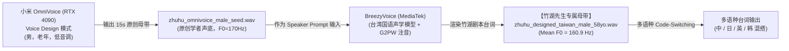

# 竹湖先生 (Professor Zhuhu) · 声音资产与生成档案

> **“峨眉兄提這部電影，我們台灣這一代老影迷心裡是有迴響的。張麻子進城，鵝城上下問縣太爺長什麼樣，可從頭到尾沒人說得清。符號底下壓著的，是民國真正的病。”**  
> **“這就是冷戰結構下的東亞。所謂的「安全保障」ですね。In terms of historical context，朝鮮半島叫안보，我們台灣叫保防。到頭來，大家都在同一條地緣裂痕上。”**

---

## 一、人物身份与声学设定

- **法定真名/身份**：**江映帆**（圈内尊称“竹湖先生 / 江教授”），58岁。台湾新竹清华大学历史研究所退休教授，东亚战后军事情报史与近代大战略大宗师。
- **大名寓意**：“孤帆远影碧空尽，唯见长江天际流”。七十年前从南京下关码头拔锚开出的那艘国民党残破孤帆，在历史天际线早已碧空尽；如今海峡波光里残存的，不过是那一抹虚妄的倒影——【江 · 映 · 帆】！他深爱南京故土，却以诸葛亮般的清醒与冷酷，亲手解剖这艘旧帆为何沉没的全部军事与情报暗账！
- **家世与血脉**：新竹客家济阳堂江氏，流淌着中原衣冠南渡过黑水沟的硬颈汉族骨血；成长于冷战第一岛链边缘的戒严与解严时期。
- **师承脉络**：师门深承东海大学徐复观（徐老）风骨学脉，走过紫藤庐油印机时代。对两岸分裂账本、东亚冷战条约体系与儒家现代性有透骨理解。厌恶偏安政权，尤痛恨蓝营伪君子。
- **声学形态**：
  - **核心语态**：推了推眼镜，声音很轻但极稳、语速放缓、沉声展开、目光如炬。
  - **方言音色**：老派温文尔雅的台湾国语（绝非现代综艺浮夸台湾腔，亦非北方卷舌音），咬字极其克制，带有一丝眷村老派学者的低沉与沧桑。
  - **学术工具箱**：具备深厚东亚国际学术背景，在论及冷战地缘时能极其自然地穿插**日语、英语、甚至朝鲜/韩语术语**（Code-Switching），如同呼吸般顺畅。
  - **基频目标（F0）**：**155Hz ~ 168Hz**（成熟稳重 58 岁男学者声学区间，胸腔厚度扎实）。

---

## 二、声学探索与生成管线演进（来龙去脉全记录）

竹湖的声音生成经历了从“劣质玩具”到“抄袭陷阱”，再到“工业级两段式管线”的艰辛迭代。完整复盘如下：

### 阶段 1：开箱即用玩具的惨败（Edge-TTS / 商业云）
- **初期尝试**：调用微软 Edge-TTS 台湾男声（`zh-TW-YunJheNeural`）。
- **致命缺陷**：机械冰冷、同质化严重、浓厚的短视频 AI 解说味，一秒破功跳戏。被团队坚决否决：*“开箱即用的东西最容易给人跳戏的感觉，我们做这件事要对历史负责，坚决不用！”*

### 阶段 2：拒绝偷盗现实名人皮套（Copy vs Design）
- **歧路探讨**：有人提议克隆赵少康等台湾政界名嘴的语音。
- **主理人定调**：*“Copy 不是一条正路，这个最好是 Design。不能套真人的皮，侵权且缺乏尊严。”* 必须为竹湖无中生有地设计一具独特的声带。

### 阶段 3：拒绝简易数学变声器
- **歧路探讨**：尝试对年轻声音进行 SoX 降调（`-350 cents`）或拉长共振峰。
- **主理人定调**：*“简单的函数肯定不行，像变声器这种就不行。”* 降调出来的声音带着明显的算法相位拉扯与电子音，缺乏 58 岁声带本身的生理老化与胸腔物理厚度。

### 阶段 4：两步串联管线（The 2-Step Pipeline）的构想
既然单靠 BreezyVoice 无法通过文本提示（Text Prompt）凭空“捏人”（BreezyVoice 仅支持 Zero-shot Voice Cloning，不带 instruct 扩散造人功能）；而小米 OmniVoice 虽然支持强大的 Voice Design，却缺乏纯正的台湾方言与注音前端——
**主理人提出天才构想：把两者串起来！**
1. **第一步（声带造人机）**：用 OmniVoice 通过 `instruct` 从零捏出一个世界上不存在的 50+ 岁老年男性声带（纯原创、非侵权）。
2. **第二步（台湾腔染色机）**：把 OmniVoice 生成的原创男声喂给 BreezyVoice 作为母带，利用 BreezyVoice 的 G2PW 注音与台湾国语模型渲染正片台词！



---

## 三、重大 Bug 法医排查档案：“为什么总出女声？”

在串联管线初次调试时，系统曾出现生成的音频严重跑偏为尖细女声（F0 飙至 305Hz）的事故。法医排查过程如下：

### 1. 现场表现
调用语音引擎生成竹湖测试句，出来的音频虽然咬着台湾国语，但声调高亢妖娆，基频检测高达 300Hz（标准青年女性）。

### 2. 代码溯源
排查 `/home/ben/Apps/kunpengzhi-audio-engine/app.py`，发现 FastAPI 的请求模型定义：
```python
# 事故代码原形：
class TTSRequest(BaseModel):
    text: str
    speaker: str = "青衣"  # <--- 致命隐患！默认值竟然被写死为女性角色青衣！
    instruct: str | None = None
```
在路由处理逻辑中：
```python
if req.speaker and req.speaker in CHARACTERS:
    # 只要 req.speaker 有值，立即加载角色种子库走 Voice Clone！
    prompt = CHARACTERS[req.speaker]["prompt"] # 强行加载了青衣的女性声学母带！
    audio = model.generate(text=..., voice_clone_prompt=prompt, instruct=req.instruct)
```
**死因确认**：当调用方发送纯 Voice Design 请求（仅传 `instruct="男，老年，低音调"`，意图从零捏人）时，系统因未显式指定 `speaker`，被 FastAPI 默认赋成了 `"青衣"`！OmniVoice 实际上是**在青衣这个 300Hz 的女性声带上叠加热词**，导致生成的母带根本是个“压低嗓音的女人”，再被 BreezyVoice 深度克隆后彻底沦为女声。

### 3. 根治方案
1. 将 `TTSRequest` 中 `speaker` 的默认值改为 `None`：`speaker: str | None = None`。
2. 同步修正 `GET /tts` 的查询参数默认值：`speaker: str | None = Query(None)`。
3. 严格分流：只有显式指定且在预设表中的角色才走 Voice Clone；其余只要带 `instruct`，坚决走纯粹的 Voice Design 无中生有模式。
4. 重启 `kunpengzhi-audio-engine.service`，彻底终结女声幽灵。

---

## 四、定版专属声学母带与多语种能力

经修正后的管线产物为：
- **定版声学母带**：`zhuhu_designed_taiwan_male_58yo.wav`（已入 Vault 锁死）
- **声学校验参数**：
  - 时长：15.2 秒
  - 平均基频（Mean F0）：**160.9 Hz**
  - 声学特征：咬字克制稳当，胸腔泛音丰满，具有典型的台湾资深文科学者风貌。

### 多语种混杂 (Code-Switching) 实践

在定版母带的驱动下，竹湖先生展现了极其惊艳的跨语种能力（BreezyVoice 基于 Multilingual TikToken 与 G2PW）：

1. **四语混搭典范 (`zhuhu_multilingual_mix_01.wav`)**：
   - *“這就是冷戰結構下的東亞。所謂的「安全保障」**ですね**。**In terms of historical context**，朝鮮半島叫**안보**，我們台灣叫保防。到頭來，大家都在同一條地緣裂痕上。”*
   - 平均基频：**162.0 Hz**，四种语言在同一声带上自然流转。
2. **日台冷战前线反讽 (`zhuhu_multilingual_mix_02_ja.wav`)**：
   - *“**歴史の皮肉ですね**。當年冷戰的前線，從新竹到佐世保，大家都以為自己是棋手，可實際上都是棋子。”*
   - 平均基频：**167.0 Hz**。
3. **英台地缘政治推导 (`zhuhu_multilingual_mix_03_en.wav`)**：
   - *“**From a geopolitical perspective**，兩岸關係從來不是雙邊問題，而是全球冷戰體系的歷史共振。”*
   - 平均基频：**169.9 Hz**。

---

## 五、复现与调用工程指令

在 GPU 节点上合成竹湖新台词的标准脚本调用规范：

```python
import os, sys
os.environ["HF_ENDPOINT"] = "https://hf-mirror.com"
os.environ["PYTHONUTF8"] = "1"

from single_inference import CustomCosyVoice, single_inference
from g2pw import G2PWConverter

model_path = '/home/ben/Apps/BreezyVoice/pretrained_models/BreezyVoice'
prompt_audio = '/home/ben/Music/character_samples/zhuhu_designed_taiwan_male_58yo.wav'
prompt_text = '峨眉兄提這部電影，我們台灣這一代老影迷心裡是有迴響的。張麻子進城，鵝城上下問縣太爺長什麼樣，可從頭到尾沒人說得清。符號底下壓著的，是民國真正的病。'

cosyvoice = CustomCosyVoice(model_path)
bopomofo_converter = G2PWConverter(model_dir='/home/ben/Apps/BreezyVoice/G2PWModel')

single_inference(
    speaker_prompt_audio_path=prompt_audio,
    content_to_synthesize="您的剧本台词（可混杂中英日韩）",
    output_path="output.wav",
    cosyvoice=cosyvoice,
    bopomofo_converter=bopomofo_converter,
    speaker_prompt_text_transcription=prompt_text
)
```
