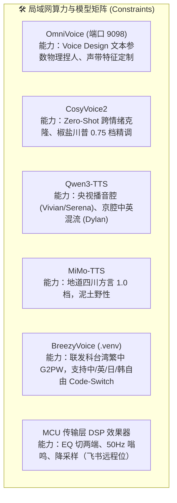

# 《三更道场》声音资产与声学工程档案总册 (Voice Archives)

> **“莫言天地无青史，三更开卷审列国。”**  
> **“声纹即法统，音韵即人设。严禁脱离工程算力与物理约束做空头资产。”**  
>
> 本档案库记录《鲲鹏志·三更道场》广播剧/播客全角色声音资产的诞生来龙去脉、声学法医分析、技术选型演进与各角色工程生成管线。

---

## 一、 当前实际技术约束与算力边界 (Engineering Constraints)

在当前本地 GPU 算力集群（RTX 4090 / RTX 3060）与已验证技术栈下，系统定义了明确的**物理与声学硬边界**：



### 核心约束守则：
1. **情绪状态机克制**：当前神经网络声学模型（如 CosyVoice2）适宜表现**室内知识分子克制交锋**（压低、骤降、冷峻、反讽）；严禁设计超出模型声码器能力的舞台剧式嚎啕大哭或尖叫，避免引入机械塑料杂音。
2. **在场 vs 远程物理分层**：
   - **近场电容麦（Direct Clean）**：青衣、峨眉、乐山、知春（肉身在场，干净无损通道）；
   - **飞书远程连线（MCU DSP）**：渔阳、紫金、琅琊、云中、番禺、良渚、敦煌、竹湖、酒泉（经 DSP 处理：窄带 EQ 截断、低电平底噪、微弱网络码率感）。
3. **架构解耦铁律**：彻底解耦 `cast_order`（法定席位序号）与 `voice_asset_id`（声学母带编号），严禁混用单一数字。

---

## 二、 角色声音资产全息总表 (严格反映当前实际 Constraint)

### 🟢 梯队一：定板已锁定资产 (Phase 1 · 核心首发 5 人组)
> 拥有经过多轮听感比对已锁死的原始母带，声纹已哈希固化在 `/home/ben/Music/character_samples/`。

| 席位 | 声学ID | 花名 | 法定真名 | 物理母带文件 (`.wav`) | F0目标区间 | 语言/方言调谐 | 传输链路 | 当前工程状态 |
|:---:|:---:|:---:|:---:|---|:---:|---|:---:|:---:|
| **01** | `VOICE_01` | [青衣](./01_青衣_Qingyi__VOICE01.md) | **秦雍琼** | `01_qingyi_青衣.wav` | 210-235Hz | 央视级李梓萌标准国语 / 清澈端庄 | Direct Clean | **🔒 已锁死 (Locked)** |
| **03** | `VOICE_02` | [峨眉](./03_峨眉_Emei__VOICE02.md) | **梅心易** | `02_emei_峨眉.wav` | 135-155Hz | 椒盐川普 (0.75 档) / 散打评书底色 | Direct Clean | **🔒 已锁死 (Locked)** |
| **04** | `VOICE_03` | [乐山](./04_乐山_Leshan__VOICE03.md) | **游牧仁** | `03_leshan_乐山.wav` | 125-145Hz | 地道四川话 (1.0 档 ➔ 讲课降档) | Direct Clean | **🔒 已锁死 (Locked)** |
| **05** | `VOICE_04` | [渔阳](./05_渔阳_Yuyang__VOICE04.md) | **于鲜洋** | `05_yuyang_渔阳.wav` | 130-150Hz | 老北京京片子儿化音 / 华尔街中英混流 | Feishu DSP | **🔒 已锁死 (Locked)** |
| **07** | `VOICE_05` | [紫金](./07_紫金_Zijin__VOICE05.md) | **王佑德** | `04_zijin_紫金.wav` | 130-145Hz | 李永乐式大黑板推导慢语速 / 咬字如切金 | Feishu DSP | **🔒 已锁死 (Locked)** |

---

### 🟡 梯队二：工程实验探索中 (Phase 1.5 · 具备候选样音)
> 模型管线已打通，当前正在进行多候选方案盲测与多语种混流校准。

| 席位 | 声学ID | 花名 | 法定真名 | 实验阶段母带候选 | F0目标区间 | 核心管线与方言特征 | 传输链路 | 当前工程状态 |
|:---:|:---:|:---:|:---:|---|:---:|---|:---:|:---:|
| **08** | `VOICE_06` | [琅琊](./08_琅琊_Langya__VOICE06.md) | **迟阆钟** | `langya_qingdao_optA_mid.wav` | 120-140Hz | 胶东青岛海蛎子味普通话 / 中气充沛七级海浪 | Feishu DSP | **🔬 3选型对比中 (Testing)** |
| **14** | `VOICE_07` | [竹湖](./14_竹湖_Zhuhu__VOICE07.md) | **江映帆** | `zhuhu_designed_taiwan_male_58yo.wav` | 155-168Hz | Voice Design ➔ BreezyVoice (中英日英四语混杂) | Feishu DSP | **🔬 混流微调中 (Tuning)** |

---

### ⚪ 梯队三：声学蓝图就绪 / 待算力批量生产 (Phase 2 · 候补 8 人组)
> 人物小传、认识论、禁演清单与声学指纹定义已就绪，等待局域网 GPU 节点下发推理生产。

| 席位 | 声学ID | 花名 | 法定真名 | 规划母带编号 | F0规划区间 | 规划核心管线 | 传输链路 | 当前工程状态 |
|:---:|:---:|:---:|:---:|---|:---:|---|:---:|:---:|
| **02** | `VOICE_08` | [盛乐](./02_盛乐_Shengle__VOICE08.md) | **孛儿只斤·敖日其楞** | `08_shengle_盛乐.wav` | 115-135Hz | OmniVoice 蒙普染色 + CosyVoice2 豪迈声底 | Direct Clean | **📋 待排期 (Queued)** |
| **06** | `VOICE_13` | [珞珈](./06_珞珈_Luojia__VOICE13.md) | **落花生** | `13_luojia_珞珈.wav` | 135-150Hz | 楚地鄂东官话普通话 / 语速快 / 尖锐条约法医 | Feishu DSP | **📋 待排期 (Queued)** |
| **09** | `VOICE_09` | [云中](./09_云中_Yunzhong__VOICE09.md) | **云久元** | `09_yunzhong_云中.wav` | 125-145Hz | 晋北大同底色官话 / 沉郁苍凉 / 落地有声 | Feishu DSP | **📋 待排期 (Queued)** |
| **10** | `VOICE_10` | [番禺](./10_番禺_Panyu__VOICE10.md) | **潘谦钺** | `10_panyu_番禺.wav` | 135-150Hz | 儒雅广普 / 慢品工夫茶 / 席下藏钺台风动力学 | Feishu DSP | **📋 待排期 (Queued)** |
| **11** | `VOICE_11` | [良渚](./11_良渚_Liangzhu__VOICE11.md) | **梁随祝** | `11_liangzhu_良渚.wav` | 140-155Hz | 江浙吴音底色普通话 / 缜密清冷 / 古DNA双螺旋 | Feishu DSP | **📋 待排期 (Queued)** |
| **12** | `VOICE_12` | [敦煌](./12_敦煌_Dunhuang__VOICE12.md) | **黄拓石** | `12_dunhuang_敦煌.wav` | 120-138Hz | 西北兰州官话底色 / 黄土沉积风沙感 / 托石老队长 | Feishu DSP | **📋 待排期 (Queued)** |
| **13** | `VOICE_14` | [知春](./13_知春_Zhichun__VOICE14.md) | **丛中笑** | `14_zhichun_知春.wav` | 125-142Hz | 天津卫相声曲艺底色 / 微胖松弛中音 / 拜占庭解构 | Direct Clean | **📋 待排期 (Queued)** |
| **15** | `VOICE_15` | [酒泉](./15_酒泉_Jiuquan__VOICE15.md) | **唐数敕** | `15_jiuquan_酒泉.wav` | 145-160Hz | 西北极客快速连珠炮 / 算法即国家敕令 | Feishu DSP | **📋 待排期 (Queued)** |

---

## 三、 人物声音圣经：八层工业级生产规范 (Standard Schema)

后续每个分册在扩建定稿时，必须严格遵守以下八层结构（不得缺项，不得用文学辞藻替代工程参数）：

```text
1. 法定履历 (Jurisdictional Biography) —— 解决“他凭什么坐在这里”
2. 学术人格 (Epistemic Matrix)         —— 相信什么、不信什么、认什么证据、碰到什么发火
3. 私人伤口 (Personal Vulnerability)   —— 为何研究此问题、怕失去什么、哪句话刺穿教授身份
4. 人际拓扑 (Interpersonal Topology)   —— 尊重谁、看不起谁、替谁圆场、被谁说服丢脸、私下称呼
5. 声学指纹 (Acoustic Fingerprint)     —— F0区间、语速、共鸣腔、口音浓度、笑声、激动反应
6. 情绪状态机 (Emotion State Machine)  —— BASE / PROBE / ATTACK / DEFEND / BREAK / AFTERGLOW
7. 禁演清单 (Negative Constraints)     —— 严格列出该角色绝不能出现的发音与表达禁忌
8. 十二句校准台词 (12-Line Benchmark)  —— 统一横向拉开度测试数据集
```

---

> 档案维护者：Antigravity 系统架构组  
> 最新更新时间：2026-09-18
