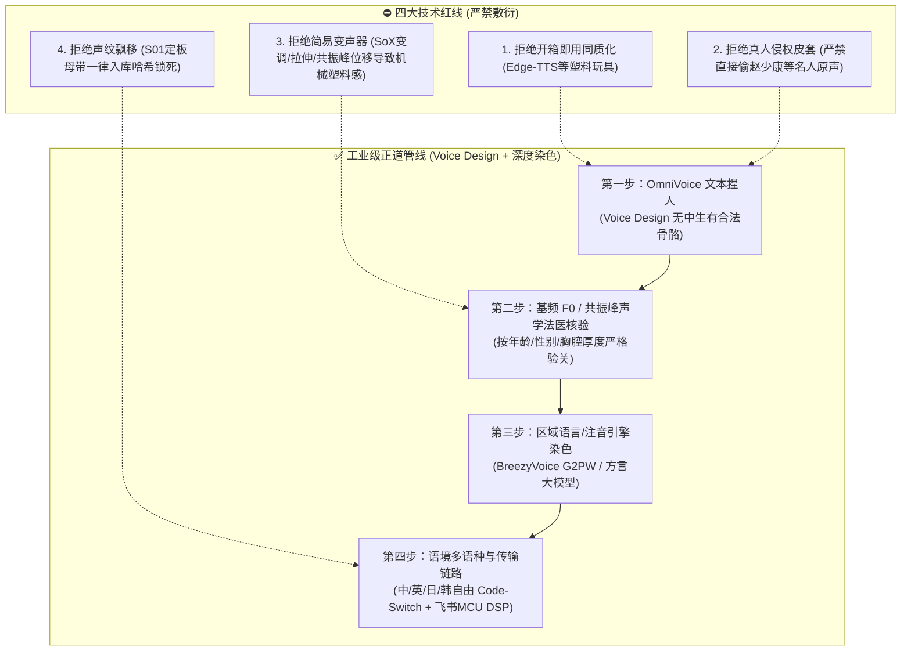

# 《三更道场》声音资产与生成档案总册 (Voice Archives)

> **“莫言天地无青史，三更开卷审列国。”**  
> **“我们做的这件事要对历史负责，声纹即法统，音韵即人设。”**  
> 
> 本档案库记录《鲲鹏志·三更道场》广播剧/播客全角色声音资产的诞生来龙去脉、声学法医分析、技术选型演进与各角色工程生成管线。

---

## 目录索引

| 序号 | 角色档案 | 法定真名 | 角色定位与文脉暗线 | 年龄/身份 | 声纹特征与方言 | 核心生成管线 |
|:---:|---|---|---|---|---|---|
| **01** | [青衣 (Qingyi)](./01_青衣_Qingyi.md) | **秦雍琼** | 常驻司仪主控 (秦台长) · 雍容大统 | 38岁 / 广电总台副台长 | 央视李梓萌级标准国语 / 清澈端庄威严 | OmniVoice Seed + Qwen3-TTS |
| **02** | [峨眉 (Emei)](./02_峨眉_Emei.md) | **梅心易** | 常驻学术主理人 (老梅) · 梅花心易 | 46岁 / 川大哲学副教授 | 椒盐川普 (0.75档) / 散打评书 / 语调微扬 | CosyVoice2 + 情绪微调 |
| **03** | [乐山 (Leshan)](./03_乐山_Leshan.md) | **游牧仁** | 考古坐地户 (老游) · 梅游组合 | 52岁 / 省考古院资深领队 | 地道四川话 (1.0档➔讲课降档) / 泥土野性 | OmniVoice 四川方言 + MiMo-TTS |
| **04** | [渔阳 (Yuyang)](./04_渔阳_Yuyang.md) | **于鲜洋** | 金融总审计 (老于) · 鱼羊为鲜 | 48岁 / 央财金融史教授 | 地道京片子儿化音 / 华尔街中英混流 | OmniVoice 京音 + Qwen3 混流 |
| **05** | [紫金 (Zijin)](./05_紫金_Zijin.md) | **王佑德** (Jude Wang) | 浑名王永乐 · 天权记总教头 | 42岁 / 中科大南大双聘 | 李永乐式大黑板推导慢语速 / 咬字切金 | OmniVoice 学者底色 + 窄带DSP |
| **06** | [琅琊 (Langya)](./06_琅琊_Langya.md) | **迟阆钟** | 谐音痴郎中 · 西太平洋号脉人 | 55岁 / 东方红3号深海船长 | 胶东海蛎子味普通话 / 中气充沛七级海浪 | OmniVoice 胶东方言设计 + 海况混响 |
| **07** | [竹湖 (Zhuhu)](./07_竹湖_Zhuhu.md) | **江映帆** | 孤帆远影碧空尽 · 战后谍战宗师 | 58岁 / 新竹清华历史所退休 | 老派温文尔雅台湾国语 / 四语混流 | **Voice Design 原创母带 ➔ BreezyVoice** |
| **08** | [盛乐 (Shengle)](./08_盛乐_Shengle.md) | **孛儿只斤·敖日其楞** | 正典老敖 · 八种死文字草原刀客 | 46岁 / 内师大北亚游牧史教授 | 豪迈蒙普 / 胸腔极大 / 烈酒长调喉音 | OmniVoice 蒙普染色 + CosyVoice2 |
| **09** | [云中 (Yunzhong)](./09_云中_Yunzhong.md) | **云久元** | 土默特万户后裔 · 540年九元大账 | 54岁 / 大同大学古建教授 | 晋北大同底色官话 / 沉郁苍凉 / 落地有声 | OmniVoice 晋北方言 + 沧桑学者微调 |
| **10** | [番禺 (Panyu)](./10_番禺_Panyu.md) | **潘谦钺** | 席下藏钺先礼后兵 · 广府十三行 | 46岁 / 中大大气科学教授 | 儒雅广式普通话 / 慢品工夫茶 / 字字如刀 | OmniVoice 粤普特征 + 理性克制 |
| **11** | [良渚 (Liangzhu)](./11_良渚_Liangzhu.md) | **梁随祝** | 梁祝化蝶永相随 · 四梁八柱古DNA | 44岁 / 浙大生命科学首席 | 江浙吴语底色普通话 / 缜密清冷 / 逻辑严丝合缝 | OmniVoice 吴音普通话 + 极客清亮 |
| **12** | [敦煌 (Dunhuang)](./12_敦煌_Dunhuang.md) | **黄拓石** | 黄石纪托帕石 · 第四纪地质老队长 | 56岁 / 兰大地质金石带头人 | 西北兰州底色普通话 / 风沙厚重 / 沉雄如山 | OmniVoice 西北官话 + 浑厚胸腔 |
| **13** | [珞珈 (Luojia)](./13_珞珈_Luojia.md) | **落花生** (落读Lào) | 落花有情今为花生 · 条约法医 | 42岁 / 武大法学院副教授 | 楚地鄂东官话普通话 / 语速快 / 手术刀级尖锐 | OmniVoice 楚地方言 + 逻辑锐利 |
| **14** | [知春 (Zhichun)](./14_知春_Zhichun.md) | **丛中笑** | 忠孝两全丛中笑 · 字节跳动老捧哏 | 43岁 / 中科院计算所特聘 | 天津卫调侃普通话 / 松弛幽默 / 捧哏解构 | OmniVoice 天津味 + 微胖松弛中音 |
| **15** | [酒泉 (Jiuquan)](./15_酒泉_Jiuquan.md) | **唐数敕** (第二季) | 数学痴 · 算法即国家敕令 | 36岁 / 西工大数学系教授 | 西北极客快速普通话 / 密度极高 / 纯粹理科压迫 | OmniVoice 青年极客音 + 快速连珠炮 |

---

## 核心设计哲学与技术红线

在构建本剧的声音系统时，团队确立了四条不可动摇的声学与伦理红线：

1. **拒绝开箱即用同质化（Toy Free）**：
   市面上的商业开箱即用声音（如 Edge-TTS、标准云端配音）一听就带有强烈的机器感与短视频俗套感，极易让人出戏。《三更道场》承载重度历史账本与学术交锋，声线必须具备真实人物的血肉与岁月包浆。
2. **拒绝侵权真人皮套（Design over Copy）**：
   声音不是给历史名人“套皮套”，直接 Copy 现实公众人物（如赵少康等）是不合规、无版权且缺乏创作者尊严的死路。真正的正道是通过 **Voice Design（从零原创声学设计）** 捏出一具世界上原本不存在的独特声带。
3. **拒绝简单数学变声器（No Cheap DSP Shifter）**：
   通过数学函数简单的 Pitch Shift（降调）或 Formant 调整，只会把年轻人变成滑稽的变声器怪兽，完全做不出老年学者声带边缘的轻微沙哑、胸腔共振下潜与呼吸气口。必须让神经声学模型从底层声带物理特性上原生生成。
4. **方言立人设，不靠字幕靠一耳朵区分**：
   全场只有司仪青衣是绝对标准的李梓萌级央视国语作为基准锚点，其余所有学者常驻与嘉宾全部带有鲜明的地缘方言底色（川普、京片子、青岛话、台湾国语、山普等）。

---

## 硬件算力与推理引擎矩阵

声音生产矩阵统一托管于局域网 GPU 计算节点：

- **GPU 核心节点**：NVIDIA GeForce RTX 4090 (24GB VRAM) / RTX 3060 (12GB VRAM)
- **底层服务架构**：
  - `kunpengzhi-audio-engine` (OmniVoice，监听端口 `9098`)：负责文本声学设计（Voice Design）与特定角色高保真推理。
  - `BreezyVoice` 独立虚拟环境 (`/home/ben/Apps/BreezyVoice/.venv`)：联发科繁体中文/台湾国语 G2PW 注音声学大模型，负责台湾学者与东亚多语种 code-switching 推理。
  - `CosyVoice2 / Qwen3-TTS` 实验环境：负责多情绪克隆与高密度口音合成。
- **声音母带库存储**：
  - `/home/ben/Music/character_samples/`（主从节点 rsync 实时对齐）

---

> 详细各角色的声学背景、工程配置与参数详见各自分册文档。
