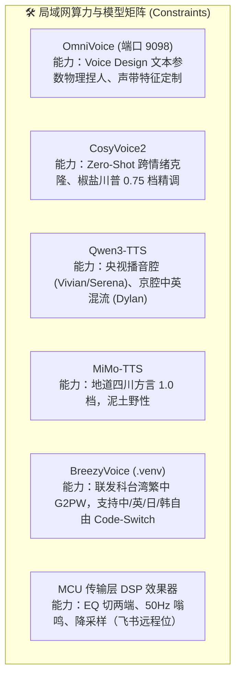

# 《三更道场》声音资产与声学工程档案总册 (Voice Archives)

> **“莫言天地无青史，三更开卷审列国。”**  
> **“声纹即法统，音韵即人设。严禁脱离工程算力与物理约束做空头资产。”**  
>
> 本档案库记录《鲲鹏志·三更道场》广播剧/播客全角色声音资产的诞生来龙去脉、声学法医分析、技术选型演进与各角色工程生成管线。

---

## 一、 当前实际技术约束与算力边界 (Engineering Constraints)

在当前本地 GPU 算力集群（RTX 4090 / RTX 3060）与已验证技术栈下，系统定义了明确的**物理与声学硬边界**：


```mermaid
flowchart TD
    subgraph 现有可用算力引擎["🛠 局域网算力与模型矩阵 (Constraints)"]
        M1["OmniVoice (端口 9098)<br/>能力：Voice Design 文本参数物理捏人、声带特征定制"]
        M2["CosyVoice2<br/>能力：Zero-Shot 跨情绪克隆、椒盐川普 0.75 档精调"]
        M3["Qwen3-TTS<br/>能力：央视播音腔 (Vivian/Serena)、京腔中英混流 (Dylan)"]
        M4["MiMo-TTS<br/>能力：地道四川方言 1.0 档，泥土野性"]
        M5["BreezyVoice (.venv)<br/>能力：联发科台湾繁中 G2PW，支持中/英/日/韩自由 Code-Switch"]
        DSP["MCU 传输层 DSP 效果器<br/>能力：EQ 切两端、50Hz 嗡鸣、降采样（飞书远程位）"]
    end
```

### 核心约束守则：

> ⚠ **上图是“能力宣称矩阵”，与本机实不符**（`MiMo-TTS` 是厂牌叫错名——k2-fsa＝小米，实为 E1；CosyVoice 仅源码无权重；Qwen3-TTS 与 BreezyVoice 非常驻但**权重在本机**）。
> **实产一律以 §一·B 引擎矩阵为准**；两处冲突时以 §一·B 与角色卡第 9 层为准。
1. **情绪状态机克制**：当前神经网络声学模型（如 CosyVoice2）适宜表现**室内知识分子克制交锋**（压低、骤降、冷峻、反讽）；严禁设计超出模型声码器能力的舞台剧式嚎啕大哭或尖叫，避免引入机械塑料杂音。
2. **在场 vs 远程物理分层**：
   - **近场电容麦（Direct Clean）**：青衣、峨眉、乐山、知春（肉身在场，干净无损通道）；
   - **飞书远程连线（MCU DSP）**：渔阳、紫金、琅琊、云中、番禺、良渚、敦煌、竹湖、酒泉（经 DSP 处理：窄带 EQ 截断、低电平底噪、微弱网络码率感）。
3. **架构解耦铁律**：彻底解耦 `cast_order`（法定席位序号）与 `voice_asset_id`（声学母带编号），严禁混用单一数字。
4. **一人六合**：每个锁定角色在 `~/Music/voice_assets/<花名>/` 下**必须**有六条基线（`base/probe/attack/defend/break/afterglow`），对应第六层情绪状态机六态。一条声底糊全剧 = 不合格资产。
5. **四层物理拓扑**（详见 `~/Music/voice_assets/locked/README.md`）：
   - **法统层**＝本目录 `voices/*.md`（唯一索引，路径全用绝对 `file:///` 引用）；
   - **冻结母带层**＝`~/Music/voice_assets/locked/`（声底父母 + 已定版母带，随附 `SHA256SUMS.txt`，入库即永不覆盖/改名/删除）；
   - **六合基线仓**＝`~/Music/voice_assets/<花名>/`（六格分装，一格一锁）；
   - **毕业成品层**＝`~/Music/san_geng_dao_chang/sXX/`（已播出的整段音频）；
   - **试音室**＝`~/Music/san_geng_dao_chang_audition/<花名>/*_segments/`、**实验场**＝`~/Music/character_samples/`：两者**皆非资产**，只有听定且被档案引用者才准 pickup 进 `locked/`。
6. **除名即记档**：作废母带挪 `~/.local/share/Trash/`（禁止 `rm`），并在 `locked/README.md` 除名表写明原因与去向；**只改档案不删物理件 = 假除名**。

---

## 一·B、 本机引擎矩阵 (Engine Matrix · 2026-09-21 实地核查)

> **档案缺陷记录**：本档案此前只写“pipeline: OmniVoice / CosyVoice2 / MiMo-TTS / Qwen3-TTS”这种**形容词式一句带过**，
> 从未说明这台机器上到底有几个模型、哪个在跑、哪个已经跑不起来。以下矩阵为**实地 `systemctl` / 端口 / 权重目录核查**结果，
> 今后每个角色的第 9 层「生成谱系」**必须**从中指名唯一一个引擎。
>
> 🚨 **动手前必读坑账**：`/home/ben/Projects/gitea/multipipeline-audio-render/docs/VOICE_PITFALL_LEDGER.md`（P-01…P-11，每条带复现命令）。本矩阵是"是什么"，坑账是"怎么会错"；只读其一必踩另一。

| # | 引擎 | 物理位置 | 运行形态 | 能力 | 硬限制（实测） | 本库已冻结母带的实际出处 |
|:--:| :--- | :--- | :--- | :--- | :--- | :--- |
| **E1** | **OmniVoice** | `~/Apps/kunpengzhi-audio-engine/app.py`<br>权重 `~/Projects/rescue/models/omnivoice_model`（k2-fsa/OmniVoice，base `Qwen/Qwen3-0.6B`，28 层，apache-2.0） | ✅ **常驻**：systemd `kunpengzhi-audio-engine.service` → **:9098** | 双模：**Voice Design**（`instruct` 文本捏人）／**Voice Clone**（`*_seed.pt`） | ① `instruct` 是**闭词表**（`男/女`＋年龄段＋五档音调＋耳语＋方言名），写“温和／沙哑”直接 500。<br>② **接口无 seed 入口**：`OmniVoiceGenerationConfig` 只有 `num_step=32 / guidance_scale=2.0 / t_shift=0.1 / position_temperature=5.0 …`，**没有随机种子参数**。<br>③ 推论：**同一条 instruct，两次调用＝两个不同的人**。Design 模式天生不可复用。<br>④ `instruct` 不改变输出时长，只有 `speed` 改，且亚线性。<br>⑤ 当前 `/speakers` 已载 **4 个**：`qingyi/青衣`、`emei/峨眉`、`leshan/乐山`、`zijin/紫金`（英文键＝中文键同物）。父母谱系：紫金 ✅ 明确（`zijin_ref.wav` ＝ 冻结 `base.wav`，见 `manifest.json`）；青衣／峨眉 ❌ 5 月旧件、父母不可考；乐山 ⚠ 主理人裁定与峨眉撞脸。<br>⑥ **`*_seed.pt` 固定的是"人"，不是"条"**：文件内容为 `ref_audio_tokens + ref_text + ref_rms`（参考音替身），**不是随机种子**。实测同一 speaker／同一句／同一 speed 连调两次 ⇒ 文件字节与时长**不同**（99404B/7.26s vs 100844B/7.37s），但 F0 稳（128.2Hz vs 126.0Hz，同区间）。⇒ 结论：**E1 Clone 可复现声底身份，不可复现同一 take**；因此"重跑必重听"，逐字节比对在本引擎永远不成立（详见坑账 P-12）。 | 乐山 4 条、紫金 3 条（`04_zijin_紫金` / `ryan` / `aiden`） |
| **E2** | **Qwen3-TTS** | `~/Apps/Qwen3-TTS`（`qwen_tts` 包 + `model_local_full/`＝**base**，无预置音色，**只有它能 clone**）<br>**`~/Projects/rescue/models/qwen3-customvoice`**＝1.7B **CustomVoice**，九大预置音色在此（`spk_id`= `serena/vivian/uncle_fu/ryan/aiden/ono_anna/sohee/eric/dylan`；`dylan=beijing_dialect, eric=sichuan_dialect`） | ❌ **非常驻**：无 systemd、无固定端口；只在需要时经 `~/.hermes/plugins/qwen3tts-server/`（与 vllm **抢卡换起**）临时拉起。跑法固定：`~/Apps/Qwen3-TTS/.venv/bin/python` ＋ transformers 4.57.3（用 miniconda 的 5.x 会 `KeyError: 'default'`，坑账 §一·C 环境坑） | 两份权重**能力互斥**（2026-09-22 实地读源码，见坑账 P-14）：<br>① `generate_custom_voice(text, speaker, language, instruct)` —— 吃自然语言 instruct，**但无 seed、无 prompt 入口**；codebook 每次调用重新采样 ⇒ **连调必换脸**，且 instruct 会连音色一起改。只准用于**选型**。<br>② `create_voice_clone_prompt(ref_audio, x_vector_only_mode)` → `VoiceClonePromptItem(ref_code, ref_spk_embedding, x_vector_only_mode, icl_mode, ref_text)` 可 `torch.save` 永久固化声纹；配 `generate_voice_clone(text, voice_clone_prompt=[item])` 出音 —— **但不接收 instruct**（instruct 只活在 custom_voice / voice_design 路径）⇒ 情绪只能写进**台词**。只准用于**生产**。 | ⚠ **本行三次改判史，留此立此存照**：旧版写“预置音色不走我方 prompt ⇒ 不可原样重跑”（**判错层次**，P-13 纠正）→ P-13 又写“`spk_id` 焊死在权重里 ⇒ 本机可原样重跑”（**判错机制**，P-14 再纠正）⇒ **现行结论**：`spk_id` 只固定“音色类别”，不固定“这一次是谁”。E2 资产的声纹级可重跑性**只看 `voice_clone_prompt` 有没有存盘**；凡 CustomVoice 直出件（含已 locked 的渔阳 d4 六格、青衣定版母带）一律挂 **⚠ 无 seed 连抽产物**。 | 青衣 `qingyi_vivian_v2_cultural_anchor.wav`（直出选型件）＋ **新路线**：`qingyi_vivian_xvec.pt` 已固化，`qingyi/base.wav` 为首格 clone 件（待耳朵终审）；渔阳 `yuyang_d4_<state>` 六格（直出连抽＋DSP d4，**六格同一人未经耳朵复核**）；青衣旧 E2 六格 2026-09-22 判废挪 `不合格隔离/`。
| **E3** | **BreezyVoice** | `~/Apps/BreezyVoice`（内嵌 `cosyvoice` 子包） | ❌ 无常驻服务，`.venv` 手动拉起 | 联发科台湾繁中 G2PW，中／英／日／韩 Code-Switch | 只在实验场产出，**零冻结母带** | —（竹湖候选全在 `character_samples/`） |
| **E4** | **CosyVoice2** | `~/Projects/github/CosyVoice` | ❌ **仅源码在库，未见权重与服务** | 档案宣称：Zero-Shot 跨情绪克隆、川普 0.75 档 | **本机上从未证实可用**；峨眉档案 `pipeline` 写它，但 `02_emei_峨眉.wav` 的真实出处**不可考** | 存疑，待主理人裁定 |
| **E5** | **MiMo-TTS** | **本机无此服务名** | ❌ 不存在此名 | 档案宣称：四川方言 1.0 档 | **改判（2026-09-22）：不是无中生有，是厂牌叫错了名字。** OmniVoice 出自 **k2-fsa＝小米 AI Lab**（Povey 团队），主理人口头一贯称"小米的模型"；`MiMo-TTS` 是把厂牌名当成了引擎名。乐山冻结件实测出自 **E1 OmniVoice**（`leshan_ref.wav` 与 `leshan_chuanpu_03_共祖.wav` 字节相同）⇒ 虚记的是**名字**，不是引擎。**今后档案一律写 E1，禁止再出现 `MiMo-TTS`。** | 无（其"产出"即 E1 的产出） |

### 由矩阵导出的三条铁律

1. **一人一引擎一格**：第 9 层「生成谱系」的 `engine` 字段只能填 **E1–E5 编号**，并写明该引擎当下的运行形态；填“OmniVoice 系”这种模糊话视为空项。
2. **可复现性分三级判，禁止一句"不可重跑"糊过去**（2026-09-22 改判，原铁律 2 作废）：
   - **声纹级**——有没有固定的"人"：E1 看 `*_seed.pt`＋`/speakers` 在表；E2 **只看 `voice_clone_prompt` 存盘没有**——`spk_id` **不算**（CustomVoice 无 seed 入口，codebook 每次重采样，连调必换脸，坑账 P-14）。
   - **take 级**——能不能重出**同一条**：只有冻结文件的 SHA-256 能保证；**E1/E2 皆无随机种子入口 ⇒ take 级一律不可重跑**（坑账 P-12），有 seed 也必"重跑必重听"。
   - **环境级**——换机换时能不能复起：必须写全**权重路径 ＋ venv/解释器 ＋ 服务形态**（E2 只用 `~/Apps/Qwen3-TTS/.venv/bin/python`，transformers 4.57.3）。
   三级里断了哪一级，档案就只准挂哪一级的牌；**"没有常驻服务"不等于"不可重跑"**（P-13）。凡 take 级断裂的资产，`locked/SHA256SUMS.txt` 即其唯一身份。
3. **无"人"的通道只准选型，不准生产**（覆盖 E1 Voice Design **与 E2 Custom Voice**，2026-09-22 扩写）：两者皆无 seed 入口，输出天生一次一换；任何“六格基线”若由连续 6 次直出拼成，**听感上就不是同一个人**（2026-09-21 紫金首产犯 E1 版；2026-09-22 青衣六格犯 E2 版，主理人当场判“这里边肯定是 6 个人”）。生产唯一合法路径是：**选型通道挑出声底父母 → 固化（E1 抽 `*_seed.pt`／E2 抽 `voice_clone_prompt`）→ Clone 出六格**。⚠ 代价：E2 Clone 通道**不接收 instruct**，情绪只能写进台词。⚠ 本律 2026-09-22 起**不追溯**已 `locked/` 的旧直出件（冻结库永不改名、不重跑），但此类件必须在档案第 9 层挂"出自无 seed 连抽"警告，并补一次**六格连听**——目前 **05 渔阳 d4 六格尚未连听过**（当初一格一抽一听），列在坑账 §二 待办。

---

## 二、 角色声音资产全息总表 (严格反映当前实际 Constraint)

### 🟢 梯队一：定板已锁定资产 (Phase 1 · 核心首发 5 人组)
> **物理落点分两层**：定版声底已 pickup 至冻结库 `/home/ben/Music/voice_assets/locked/`（随附 `SHA256SUMS.txt` 全量指纹）；实验场 `/home/ben/Music/character_samples/` 只留盲测样音与废弃件。
> ⚠ 下表「物理母带」列的 `NN_` 前缀是**历史创建序号**，既不等于 `cast_order` 也不等于 `voice_asset_id`，命名规范待重立（见 §四）。

| 席位 | 声学ID | 花名 | 法定真名 | 物理母带文件 (`.wav`) | F0目标区间 | 语言/方言调谐 | 传输链路 | 当前工程状态 |
|:---:|:---:|:---:|:---:|---|:---:|---|:---:|:---:|
| **01** | `VOICE_01` | [青衣](./01_青衣_Qingyi__VOICE01.md) | **秦雍琼** | `qingyi_vivian_v2_cultural_anchor.wav` | 210-235Hz | 央视级李梓萌标准国语 / 清澈端庄 | Direct Clean | **🔒 已锁死 (Locked)** |
| **03** | `VOICE_02` | [峨眉](./03_峨眉_Emei__VOICE02.md) | **梅心易** | `02_emei_峨眉.wav` | 135-155Hz | 椒盐川普 (0.75 档) / 散打评书底色 | Direct Clean | **🔒 已锁死 (Locked)** |
| **04** | `VOICE_03` | [乐山](./04_乐山_Leshan__VOICE03.md) | **游牧仁** | `03_leshan_乐山.wav` | 125-145Hz | 地道四川话 (1.0 档 ➔ 讲课降档) | Direct Clean | **🔒 已锁死 (Locked)** |
| **05** | `VOICE_04` | [渔阳](./05_渔阳_Yuyang__VOICE04.md) | **于鲜洋** | **`yuyang_d4_base.wav`**（六格 `yuyang_d4_<state>.wav`；旧 `05_yuyang_渔阳.wav` 判薄作废） | 125-150Hz（d4 加厚后实测带） | 老北京京片子儿化音 / 华尔街中英混流（同句混说，禁单出英文） | Feishu DSP | **🔒 已锁死 (Locked)** |
| **07** | `VOICE_05` | [紫金](./07_紫金_Zijin__VOICE05.md) | **王佑德** | `04_zijin_紫金.wav` | 130-145Hz | 李永乐式大黑板推导慢语速 / 咬字如切金 | Feishu DSP | **🔒 已锁死 (Locked)** |

**五人定版母带的真实出声引擎（对照 §一·B 矩阵，档案原 `pipeline` 字段有虚记）：**

| 席位 | 档案 `pipeline` 原写 | **实测/可复核的真实出处** | 可重跑性 |
|:---:| :--- | :--- | :--- |
| 01 青衣 | OmniVoice Seed + Qwen3-TTS (Vivian) | 定版母带出自 **E2 CustomVoice 直出**（只能算选型候选）；E1 那颗 `qingyi_seed.pt` 父母不明、与定版无关（2026-09-21 已挪 Trash） | ⚠ **声纹级不可**（`spk_id` 不算锁人，P-14）；正解＝拿定版母带走 **E2 Voice Clone**，`qingyi_vivian_xvec.pt` 已固化 ⇒ 自此声纹级可、take 级仍不可。旧 E2 六格已判废挪隔离 |
| 03 峨眉 | CosyVoice2 (川普0.75档) | **不可考**：E4 本机仅有源码；E1 的 `emei_seed.pt` instruct 与本角色设定两格全违 | ❌ 三级全断：出处断线 ⇒ 真"不可原样重跑" |
| 04 乐山 | ~~MiMo-TTS~~ (川话1.0档➔降档) | **`MiMo-TTS` 是厂牌叫错名**（k2-fsa＝小米，主理人俗称"小米模型"）；冻结件与 clone 实测全部出自 **E1 OmniVoice** | ✅ 声纹级可（`leshan_seed.pt` 在 `/speakers`）／⚠ take 级不可；**声底已判与峨眉撞脸**，只挂牌不反查 |
| 05 渔阳 | Qwen3-TTS (Dylan 京普混流) | **E2 `spk_id=dylan`（beijing_dialect）＋ DSP d4 加厚层**；E1 侧 `yuyang_seed.pt` 已作废挪 Trash，`/speakers` 无"渔阳" | ⚠ **六格出自无 seed 连抽 ⇒ 声纹级不可重跑**（同句重录必换脸，P-14）；`post_dsp.af`／六条 instruct／六条台词逐字在档，环境级可起。**已 locked，但六格是否同一人尚未过耳朵复核 —— 待办** |
| 07 紫金 | OmniVoice + 慢速推导 | 现由 **E1 OmniVoice Voice Clone** 出六格（`zijin_seed.pt`，父母＝`base.wav`，SHA 入 manifest）；早期 Design 候选已判废 | ✅ 声纹级可／⚠ take 级不可（P-12）；六格**待终审 pickup** |

---

### 🟡 梯队二：工程实验探索中 (Phase 1.5 · 具备候选样音)
> 模型管线已打通，当前正在进行多候选方案盲测与多语种混流校准。

| 席位 | 声学ID | 花名 | 法定真名 | 实验阶段母带候选 | F0目标区间 | 核心管线与方言特征 | 传输链路 | 当前工程状态 |
|:---:|:---:|:---:|:---:|---|:---:|---|:---:|:---:|
| **08** | `VOICE_06` | [琅琊](./08_琅琊_Langya__VOICE06.md) | **迟阆钟** | `langya_qingdao_optA_mid.wav` | 120-140Hz | 胶东青岛海蛎子味普通话 / 中气充沛七级海浪 | Feishu DSP | **🔬 3选型对比中 (Testing)** |
| **14** | `VOICE_07` | [竹湖](./14_竹湖_Zhuhu__VOICE07.md) | **江映帆** | `zhuhu_designed_taiwan_male_58yo.wav` | 155-168Hz | Voice Design ➔ BreezyVoice (中英日英四语混杂) | Feishu DSP | **🔬 混流微调中 (Tuning)** |

---

### ⚪ 梯队三：声学蓝图就绪 / 待算力批量生产 (Phase 2 · 候补 8 人组)
> 人物小传、认识论、禁演清单与声学指纹定义已就绪，等待局域网 GPU 节点下发推理生产。

| 席位 | 声学ID | 花名 | 法定真名 | 规划母带编号 | F0规划区间 | 规划核心管线 | 传输链路 | 当前工程状态 |
|:---:|:---:|:---:|:---:|---|:---:|---|:---:|:---:|
| **02** | `VOICE_08` | [盛乐](./02_盛乐_Shengle__VOICE08.md) | **孛儿只斤·敖日其楞** | `08_shengle_盛乐.wav` | 115-135Hz | OmniVoice 蒙普染色 + CosyVoice2 豪迈声底 | Direct Clean | **📋 待排期 (Queued)** |
| **06** | `VOICE_13` | [珞珈](./06_珞珈_Luojia__VOICE13.md) | **落花生** | `13_luojia_珞珈.wav` | 135-150Hz | 楚地鄂东官话普通话 / 语速快 / 尖锐条约法医 | Feishu DSP | **📋 待排期 (Queued)** |
| **09** | `VOICE_09` | [云中](./09_云中_Yunzhong__VOICE09.md) | **云久元** | `09_yunzhong_云中.wav` | 125-145Hz | 晋北大同底色官话 / 沉郁苍凉 / 落地有声 | Feishu DSP | **📋 待排期 (Queued)** |
| **10** | `VOICE_10` | [番禺](./10_番禺_Panyu__VOICE10.md) | **潘谦钺** | `10_panyu_番禺.wav` | 135-150Hz | 儒雅广普 / 慢品工夫茶 / 席下藏钺台风动力学 | Feishu DSP | **📋 待排期 (Queued)** |
| **11** | `VOICE_11` | [良渚](./11_良渚_Liangzhu__VOICE11.md) | **梁随祝** | `11_liangzhu_良渚.wav` | 140-155Hz | 江浙吴音底色普通话 / 缜密清冷 / 古DNA双螺旋 | Feishu DSP | **📋 待排期 (Queued)** |
| **12** | `VOICE_12` | [敦煌](./12_敦煌_Dunhuang__VOICE12.md) | **黄拓石** | `12_dunhuang_敦煌.wav` | 120-138Hz | 西北兰州官话底色 / 黄土沉积风沙感 / 托石老队长 | Feishu DSP | **📋 待排期 (Queued)** |
| **13** | `VOICE_14` | [知春](./13_知春_Zhichun__VOICE14.md) | **丛中笑** | `14_zhichun_知春.wav` | 125-142Hz | 天津卫相声曲艺底色 / 微胖松弛中音 / 拜占庭解构 | Direct Clean | **📋 待排期 (Queued)** |
| **15** | `VOICE_15` | [酒泉](./15_酒泉_Jiuquan__VOICE15.md) | **唐数敕** | `15_jiuquan_酒泉.wav` | 145-160Hz | 西北极客快速连珠炮 / 算法即国家敕令 | Feishu DSP | **📋 待排期 (Queued)** |
| **16** | `VOICE_16` | [普陀](./16_普陀_Putuo__VOICE16.md) | **华忠仁** | `None (Mute/Pen)` | 待定 | **无声观察者 (失聪·便签笔谈)** / 打破第四面墙 | Silent Notes | **👁️ 无声观测 (Silent)** |
| **17** | `VOICE_17` | [岚桥](./17_岚桥_Lanqiao__VOICE17.md) | **尹卞迁** | `17_lanqiao_岚桥.wav` | 135-150Hz | 海派精英金融冷讽普 / 四证大满贯提篮桥预备役 | Feishu DSP | **📋 待排期 (Queued)** |

---

## 三、 人物声音圣经：九层工业级生产规范 (Standard Schema)

每个分册在扩建定稿时，必须严格遵守以下九层结构（不得缺项，不得用文学辞藻替代工程参数）：

```text
1. 法定履历 (Jurisdictional Biography) —— 解决“他凭什么坐在这里”
2. 学术人格 (Epistemic Matrix)         —— 相信什么、不信什么、认什么证据、碰到什么发火
3. 私人伤口 (Personal Vulnerability)   —— 为何研究此问题、怕失去什么、哪句话刺穿教授身份
4. 人际拓扑 (Interpersonal Topology)   —— 尊重谁、看不起谁、替谁圆场、被谁说服丢脸、私下称呼
5. 声学指纹 (Acoustic Fingerprint)     —— F0区间、语速、共鸣腔、口音浓度、笑声、激动反应
6. 情绪状态机 (Emotion State Machine)  —— BASE / PROBE / ATTACK / DEFEND / BREAK / AFTERGLOW（= 六合基线仓的六格）
7. 禁演清单 (Negative Constraints)     —— 严格列出该角色绝不能出现的发音与表达禁忌
8. 十二句校准台词 (12-Line Benchmark)  —— 统一横向拉开度测试数据集
9. 生成谱系 (Voice Genealogy)          —— 见 §三之二：这个声音到底怎么来的，能不能重跑
```

### §三之二 · 第 9 层「生成谱系」写法（本档案的**存在理由**）

一份档案如果不能回答「换一个模型、换一个人，能不能把这个声音原样重造出来」，它就是文学随笔，不是资产档案。第 9 层**逐条母带**填下表，一格不许空：

| 字段 | 填什么 | 为什么必须有 |
| :--- | :--- | :--- |
| `engine` | 具体引擎与端点（OmniVoice:9098 / Qwen3-TTS / CosyVoice2 / MiMo / BreezyVoice） | 换引擎＝换人 |
| `mode` | **Voice Design**（文本捏人）还是 **Voice Clone**（种子参考音） | 两条路线不可混写 |
| `instruct` | **逐字原文**，且必须在引擎闭词表内（见下） | 记“沉稳学者音”这种形容词等于没记 |
| `ref_audio` | Clone 模式：参考音的**全路径 + SHA-256**；Design 模式：`null` | 没有这行，clone 就是无源之水 |
| `speed` / `seed` | 数值原样，四舍五入都不许 | 0.88 与 1.00 不是同一个人 |
| `post_dsp` | 是否挂飞书 MCU 窄带链（300/3200Hz 截断 + 粉红噪 + 50Hz 嗡鸣） | 干音与成音必须分账 |
| `verdict` | 听定人、听定日期、废弃候选清单及废弃理由 | 防止同一错误方案被重跑 |

### §三之三 · Design ➔ Clone 的回退律（管线拓扑）

```
① Voice Design  ──闭词表 instruct 捏人──▶  N 条候选
        │            │
        │            └─ 耳朵验收 ─▶ 听定 1 条 ─▶ 入 locked/ ＝ 该角色的**声底父母**
        │                                        │
        └──────────────────────────────────────  │
                                                 ▼
② Voice Clone  ◀── ref_audio = 声底父母 ──  kunpengzhi-audio-engine 抽 *_seed.pt
                                                   │
                          六格基线（base/probe/attack/defend/break/afterglow）
                                                   │
                                        情绪/语速/文案换档，声底不变
```

**三条硬规定：**

1. **Clone 的参考音必须是 `locked/` 里的那条母带**（字节一致，SHA-256 可核）。现状：全库仅 `leshan_ref.wav` 做到（与 `leshan_chuanpu_03_共祖.wav` 字节相同）；`qingyi_ref.wav`、`emei_ref.wav` **父母不明，按律作废待重抽**。
2. **Clone 效果不佳 ⇒ 回退 ①，不在 ② 上打补丁。** 因为 Voice Clone 只继承音色，不继承表现力：参考音本身没情绪层次，换多少 seed 都救不回来。回退动作＝重发 Design 候选（改 `instruct` 或换引擎）→ 重新听定 → 换新声底父母 → 重抽 seed。旧 seed 连同其产出**整批**进 `~/.local/share/Trash/`，禁止新旧混用。
3. **`instruct` 是闭集，不能自由发挥。** OmniVoice 只认：`男/女`、`儿童/少年/青年/中年/老年`、`极低音调/低音调/中音调/高音调/极高音调`、`耳语`、方言（四川话/青岛话/河南话/石家庄话…），且不可中英混写。**“温和”“沙哑”“学者气”写进去直接 500 报错** —— 这类质感只能靠参考音与语速做出来，记档案时不许冒充参数。

### §三之四 · 命名规范（2026-09-21 起重立）

历史件（`01_qingyi_青衣.wav`、`04_zijin_紫金.wav`…）的 `NN_` 前缀是**创建流水号**，既不是席位也不是资产号，属事故。**冻结库永不重命名，旧名一律保留并登记别名**；新规矩只约束今后入库件：

| 位置 | 命名 | 说明 |
| :--- | :--- | :--- |
| `voice_assets/locked/`（平铺） | `<花名拼音>_<engine>_<编号或语义>.wav` | 例 `zijin_omnivoice_v3_kaochang.wav`；**禁止**数字前缀 |
| `voice_assets/<花名>/`（六合仓） | `<state>.wav` | 身份由路径给出，文件名不再重复角色，例 `attack.wav` |
| 试音室原子 | `<季>p<集>_<state>_<4位时序>.wav` | 半成品，永不进冻结库 |
| 毕业成品 | `s{季:02d}_ep{集:02d}_para{段:02d}_{时序}_{花名}.wav` | 沿用既有规范 |
| 档案文件 | `NN_花名_Pinyin__VOICEnn.md` | `NN`＝席位，`VOICEnn`＝声学号，两者**永不混用** |

---

> 档案维护者：Antigravity 系统架构组  
> 最新更新时间：2026-09-18
